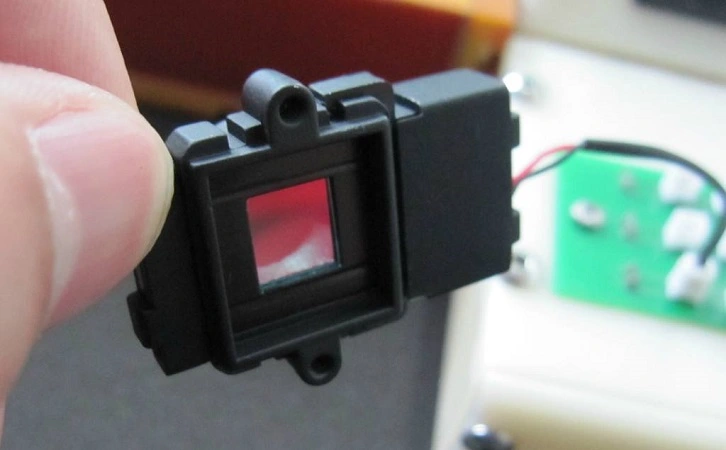

# OpenIPC Wiki
[Table of Content](../index.md)

IR-CUT (Infrared Ray Filter Switcher)
-------------------------------------

An infrared filter is placed between the camera lens and the camera's image sensor
to filter out a number of light waves that, while invisible to the naked human eye,
can affect the image produced by the camera's image sensor.

These rays cause the resulting image to take on a reddish-purple hue. Therefore,
the filter cuts off a certain wavelength of light coming through the lens, making
the resulting image closer to what we see with our eyes.

Although infrared rays are abundant and inconvenient during the day, they are still
present at night when reflected from the moon and can help the camera see better at
night. So we need to let them through to the sensor when the amount of visible light
is insufficient. We can accomplish this with an infrared filter switcher - a mechanical
device that uses electromagnetic force to move the filter in front of and away from
the image sensor.

There are at least two types of sliding mechanism for moving the filter: a drawer type
where filter moves front and back, and swing type where filter rotates around a pivoting
point.

A typical IR-CUT filter switcher for an IP camera will operate within a voltage range
of 3.5V to 12V DC. The switcher uses two wires to connect to the board and it uses
polarity reversal to change the direction of its action. The polarity change is 
controlled via GPIO. Therefore it is important to set the correct GPIO pins in the
camera settings.

Often, an infrared filter (IR) is combined with an anti-reflection filter (AR), which
reduces the amount of reflected light and increases the sensitivity of the sensor.
Sometimes both filters are combined into one and permanently attached to the housing.

The infrared ray filter housings can have different mounting hole spacing distances
(22mm, 20mm, 18mm, 16.4mm) and different types of lens mounts (S-mount, C-mount, SC-mount).
Most typical is a housing with 20mm hole spacing distance and M12x0.5mm S-type lens mount.

### Links

- <http://zonhen.com/>
- <http://solenoid.cn/>
