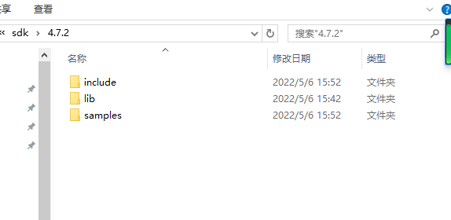
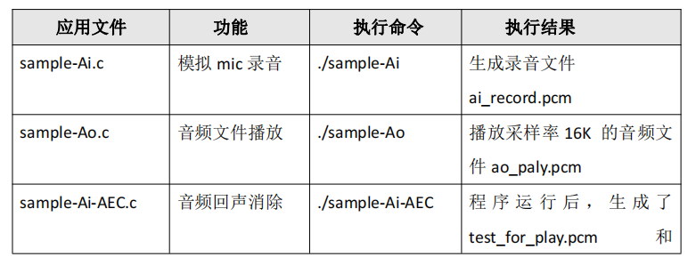
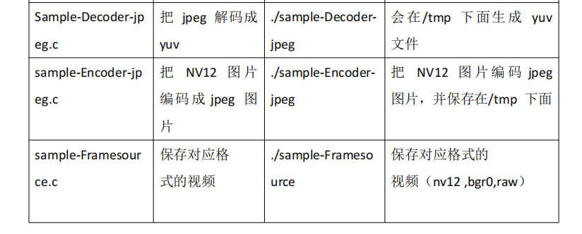

# [Ingenic T31 Application Development][toc]

Sample Introduction
-------------------

### Samples location

Sample programs are located in `/samples/libimp-samples` directory.
Samples depend on the SDK libraries, including recording and playback, echo cancellation and other applications.
Users can refer to the provided sample programs to write their own project code.

Here's the content of `ISVP-T31-1.1.5-20220428\software\sdk\Ingenic-SDK-T31-1.1.5-20220506\sdk\4.7.2`:

- __include__ contains header files for system library functions.
- __lib__ contains static and dynamic libraries of system library functions.
- __sample__ contains the source files we need to compile.

### What are the basic samples that Ingenic provides us with?

There are actually three types of applications.

The first one is a sample for audio codecs.

The second one is a sample for video codecs.

The third one is a sample for motion detection, the OSD sample.

Later I will gradually explain the relationship between these samples and the Ingenic User's Manual.
These samples are the basis for us to carry out large-scale projects, must be fully mastered.

[toc]: index.md
