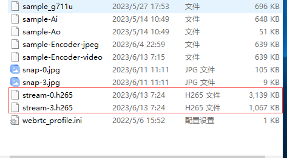
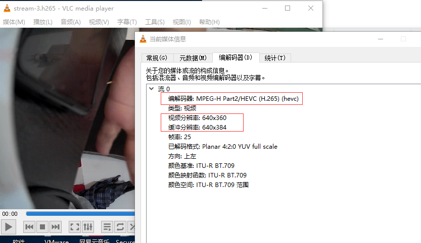

# [Ingenic T31 Application Development][toc]

Getting H265 Streams
--------------------

Block diagram of the Ingenic T31 system for acquiring H264 streams and JPEG get the stream is similar, 
are first initialized video-related interfaces, and then call to get the video stream, and finally 
release the resources of the video.


### Initialize the encoder with `sample_encoder_init`

One structure to note is that our encoding parameters are stored in a structure fs_chn_attr;

```
struct chn_conf chn[FS_CHN_NUM] = {
    {
        .index = CH0_INDEX,
        .enable = CHN0_EN,
        .payloadType = IMP_ENC_PROFILE_HEVC_MAIN,
        .fs_chn_attr = {
            .pixFmt = PIX_FMT_NV12,
            .outFrmRateNum = SENSOR_FRAME_RATE_NUM,
            .outFrmRateDen = SENSOR_FRAME_RATE_DEN,
            .nrVBs = 2,
            .type = FS_PHY_CHANNEL,

            .scaler.enable = 0,

            .crop.enable = CROP_EN,
            .crop.top = 0,
            .crop.left = 0,
            .crop.width = SENSOR_WIDTH,
            .crop.height = SENSOR_HEIGHT,

            .picWidth = SENSOR_WIDTH,
            .picHeight = SENSOR_HEIGHT,
           },
```

The main function is `IMP_Encoder_SetDefaultParam` to set the default encoding function.  In the last lesson,
we used the JPEG encoding method, and in this lesson, we mainly use the enumeration type payloadType:

```
typedef enum {
    IMP_ENC_PROFILE_AVC_BASELINE  = ((IMP_ENC_TYPE_AVC << 24) | (IMP_ENC_AVC_PROFILE_IDC_BASELINE)),
    IMP_ENC_PROFILE_AVC_MAIN      = ((IMP_ENC_TYPE_AVC << 24) | (IMP_ENC_AVC_PROFILE_IDC_MAIN)),
    IMP_ENC_PROFILE_AVC_HIGH      = ((IMP_ENC_TYPE_AVC << 24) | (IMP_ENC_AVC_PROFILE_IDC_HIGH)),
    IMP_ENC_PROFILE_HEVC_MAIN     = ((IMP_ENC_TYPE_HEVC << 24) | (IMP_ENC_HEVC_PROFILE_IDC_MAIN)),
    IMP_ENC_PROFILE_JPEG          = (IMP_ENC_TYPE_JPEG << 24),
} IMPEncoderProfile;
```

```
int sample_encoder_init()
{
    int i, ret, chnNum = 0;
    IMPFSChnAttr *imp_chn_attr_tmp;
    IMPEncoderChnAttr channel_attr;

    for (i = 0; i <  FS_CHN_NUM; i++) {
        if (chn[i].enable) {
            imp_chn_attr_tmp = &chn[i].fs_chn_attr;
            chnNum = chn[i].index;

            memset(&channel_attr, 0, sizeof(IMPEncoderChnAttr));

            float ratio = 1;
            if (((uint64_t)imp_chn_attr_tmp->picWidth * imp_chn_attr_tmp->picHeight) > (1280 * 720)) {
                ratio = log10f(((uint64_t)imp_chn_attr_tmp->picWidth * imp_chn_attr_tmp->picHeight) / (1280 * 720.0)) + 1;
            } else {
                ratio = 1.0 / (log10f((1280 * 720.0) / ((uint64_t)imp_chn_attr_tmp->picWidth * imp_chn_attr_tmp->picHeight)) + 1);
            }
            ratio = ratio > 0.1 ? ratio : 0.1;
            unsigned int uTargetBitRate = BITRATE_720P_Kbs * ratio;

            ret = IMP_Encoder_SetDefaultParam(&channel_attr, chn[i].payloadType, S_RC_METHOD,
                    imp_chn_attr_tmp->picWidth, imp_chn_attr_tmp->picHeight,
                    imp_chn_attr_tmp->outFrmRateNum, imp_chn_attr_tmp->outFrmRateDen,
                    imp_chn_attr_tmp->outFrmRateNum * 2 / imp_chn_attr_tmp->outFrmRateDen, 2,
                    (S_RC_METHOD == IMP_ENC_RC_MODE_FIXQP) ? 35 : -1,
                    uTargetBitRate);
            if (ret < 0) {
                IMP_LOG_ERR(TAG, "IMP_Encoder_SetDefaultParam(%d) error !\n", chnNum);
                return -1;
            }
            ret = IMP_Encoder_CreateChn(chnNum, &channel_attr);
            if (ret < 0) {
                IMP_LOG_ERR(TAG, "IMP_Encoder_CreateChn(%d) error !\n", chnNum);
                return -1;
            }

            ret = IMP_Encoder_RegisterChn(chn[i].index, chnNum);
            if (ret < 0) {
                IMP_LOG_ERR(TAG, "IMP_Encoder_RegisterChn(%d, %d) error: %d\n", chn[i].index, chnNum, ret);
                return -1;
            }
        }
    }

    return 0;
}
```


### Get video stream with `sample_get_video_stream`

```
int sample_get_video_stream()
{
    unsigned int i;
    int ret;
    pthread_t tid[FS_CHN_NUM];

    for (i = 0; i < FS_CHN_NUM; i++) {
        if (chn[i].enable) {
            int arg = 0;
            if (chn[i].payloadType == IMP_ENC_PROFILE_JPEG) {
                arg = (((chn[i].payloadType >> 24) << 16) | (4 + chn[i].index));
            } else {
                arg = (((chn[i].payloadType >> 24) << 16) | chn[i].index);
            }
            ret = pthread_create(&tid[i], NULL, get_video_stream, (void *)arg);
            if (ret < 0) {
                IMP_LOG_ERR(TAG, "Create ChnNum%d get_video_stream failed\n", (chn[i].payloadType == IMP_ENC_PROFILE_JPEG) ? (4 + chn[i].index) : chn[i].index);
            }
        }
    }

    for (i = 0; i < FS_CHN_NUM; i++) {
        if (chn[i].enable) {
            pthread_join(tid[i],NULL);
        }
    }

    return 0;
}
```

The main function inside is `get_video_stream`.

This is also the last call to the library function `IMP_Encoder_GetStream`.

There are also some save file IO operations, which will not continue to explain.

Finally, use `save_stream` function to save the video stream to the local above,
you can also specify the directory, such as the mounted TF card directory above.

```
static void *get_video_stream(void *args)
{
    int val, i, chnNum, ret;
    char stream_path[64];
    IMPEncoderEncType encType;
    int stream_fd = -1, totalSaveCnt = 0;

    val = (int)args;
    chnNum = val & 0xffff;
    encType = (val >> 16) & 0xffff;

    ret = IMP_Encoder_StartRecvPic(chnNum);
    if (ret < 0) {
        IMP_LOG_ERR(TAG, "IMP_Encoder_StartRecvPic(%d) failed\n", chnNum);
        return ((void *)-1);
    }

    sprintf(stream_path, "%s/stream-%d.%s", STREAM_FILE_PATH_PREFIX, chnNum,
        (encType == IMP_ENC_TYPE_AVC) ? "h264" : ((encType == IMP_ENC_TYPE_HEVC) ? "h265" : "jpeg"));

    if (encType == IMP_ENC_TYPE_JPEG) {
        totalSaveCnt = ((NR_FRAMES_TO_SAVE / 50) > 0) ? (NR_FRAMES_TO_SAVE / 50) : 1;
    } else {
        IMP_LOG_DBG(TAG, "Video ChnNum=%d Open Stream file %s ", chnNum, stream_path);
        stream_fd = open(stream_path, O_RDWR | O_CREAT | O_TRUNC, 0777);
        if (stream_fd < 0) {
            IMP_LOG_ERR(TAG, "failed: %s\n", strerror(errno));
            return ((void *)-1);
        }
        IMP_LOG_DBG(TAG, "OK\n");
        totalSaveCnt = NR_FRAMES_TO_SAVE;
    }

    for (i = 0; i < totalSaveCnt; i++) {
        ret = IMP_Encoder_PollingStream(chnNum, 1000);
        if (ret < 0) {
            IMP_LOG_ERR(TAG, "IMP_Encoder_PollingStream(%d) timeout\n", chnNum);
            continue;
        }

        IMPEncoderStream stream;
        /* Get H264 or H265 Stream */
        ret = IMP_Encoder_GetStream(chnNum, &stream, 1);
#ifdef SHOW_FRM_BITRATE
        int i, len = 0;
        for (i = 0; i < stream.packCount; i++) {
            len += stream.pack[i].length;
        }
        bitrate_sp[chnNum] += len;
        frmrate_sp[chnNum]++;

        int64_t now = IMP_System_GetTimeStamp() / 1000;
        if(((int)(now - statime_sp[chnNum]) / 1000) >= FRM_BIT_RATE_TIME){
            double fps = (double)frmrate_sp[chnNum] / ((double)(now - statime_sp[chnNum]) / 1000);
            double kbr = (double)bitrate_sp[chnNum] * 8 / (double)(now - statime_sp[chnNum]);

            printf("streamNum[%d]:FPS: %0.2f,Bitrate: %0.2f(kbps)\n", chnNum, fps, kbr);
            //fflush(stdout);

            frmrate_sp[chnNum] = 0;
            bitrate_sp[chnNum] = 0;
            statime_sp[chnNum] = now;
        }
#endif
        if (ret < 0) {
            IMP_LOG_ERR(TAG, "IMP_Encoder_GetStream(%d) failed\n", chnNum);
            return ((void *)-1);
        }

        if (encType == IMP_ENC_TYPE_JPEG) {
            ret = save_stream_by_name(stream_path, i, &stream);
            if (ret < 0) {
                return ((void *)ret);
            }
        }
#if 1
        else {
            ret = save_stream(stream_fd, &stream);
            if (ret < 0) {
                close(stream_fd);
                return ((void *)ret);
            }
        }
#endif
        IMP_Encoder_ReleaseStream(chnNum, &stream);
    }

    close(stream_fd);

    ret = IMP_Encoder_StopRecvPic(chnNum);
    if (ret < 0) {
        IMP_LOG_ERR(TAG, "IMP_Encoder_StopRecvPic(%d) failed\n", chnNum);
        return ((void *)-1);
    }

    return ((void *)0);
}
```


### Experimental Phenomena

Execute the command:


Download the generated file to a PC and use VLC version 3.0 or above to play, the effect is as follows:





[toc]: index.md
