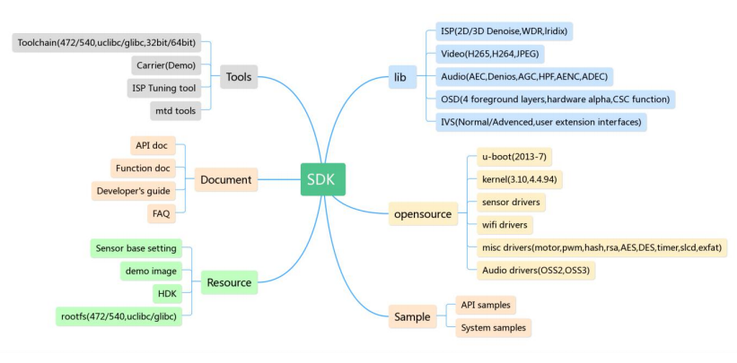

# [Ingenic T31 Application Development][toc]

Ingenic SDK Overview
--------------------

### What is Ingenic's SDK?

ISVP SDK, i.e., Software Development Kit, includes API libraries, open-source source code, documentation,
samples, and so on. 

Developers can quickly carry out product function development through SDK. Simply put, software developers
use this SDK to develop products.

#### Tools

It's actually the usual cross-compilation toolchain we use. (Development work is used in virtual machines)

ISP Tuning tools are used to tune the picture.

#### Document

It is the documentation we need to use for development, including software documentation and hardware documentation.

#### Resource

Some resource files, such as the root filesystem, HDK hardware development resources.

#### lib

Software development library files, using these library files can call the hardware functions,
including [audio and video codecs](06-audio-codecs.md), ISP mapping, OSD watermark, IVS motion detection.

#### opensource

Ingenic original factory has helped us to develop a good uboot and kernel, there are still some drivers we need 
to compile, according to their own needs.

#### Sample

Software development kit reference demo. Most of the development kit is the board pole, including 
the Ingenic system library function.

### The level of our development needs?

Broadly speaking, a product-level project requires the following R&D workers: embedded software engineers 
(driver layer), embedded software engineers (application layer), hardware engineers, system engineers.

It is recommended that college students can first study the Embedded Software Engineer (Application Layer) direction, 
which corresponds to the Application section of the chart above.

Call the API of the system level SDK provided by Ingenic chip to develop the function in combination with the sample.
This section corresponds to the application section in the figure above.

The following development experience can be engaged in the direction of the driver layer:

#### Hardware

Hardware layer, performs specific hardware functions such as I/O.

#### Linux Kernel

Kernel layer, performs basic system functions and defines hardware resources.

#### Drivers

.ko module drivers, through which hardware operations can be performed.

#### API Lib

Interface libraries, realize the abstraction of hardware functions and facilitate the development of the application layer.
API libraries mainly have five parts. Key points:
  - __libimp__ - multimedia library. H264 encoding, JPEG encoding, IVS and Audio.
  - __libsysutils__ - system libraries. For example, reboot, set system time and battery functions.
  - __libalog__ - ISVP-SDK log implementation library.
  - __libivs_inf__ - IVS algorithm library, including line crossing detection, perimeter prevention, etc.
  - __libmxu__ - 128-bit MXU acceleration instruction library.

#### Application

Application layer. It realizes the function logic and so on. 
Application is recommended to use the API provided by the SDK library and drivers for development.
For some special functional requirements, you can also directly call the kernel interface for development.

[toc]: index.md
