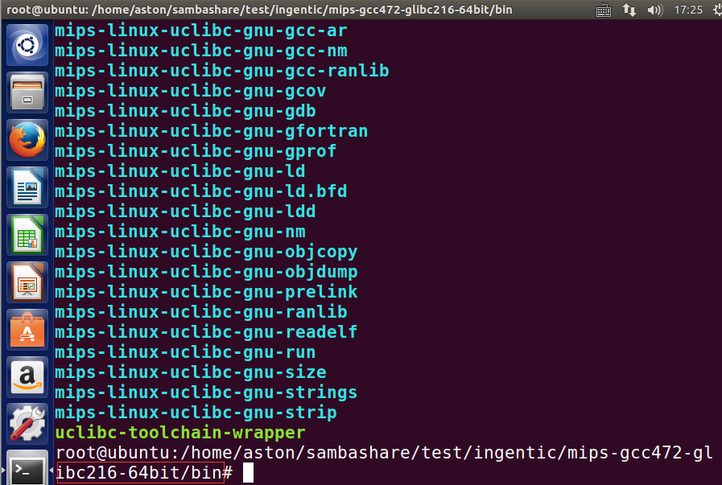
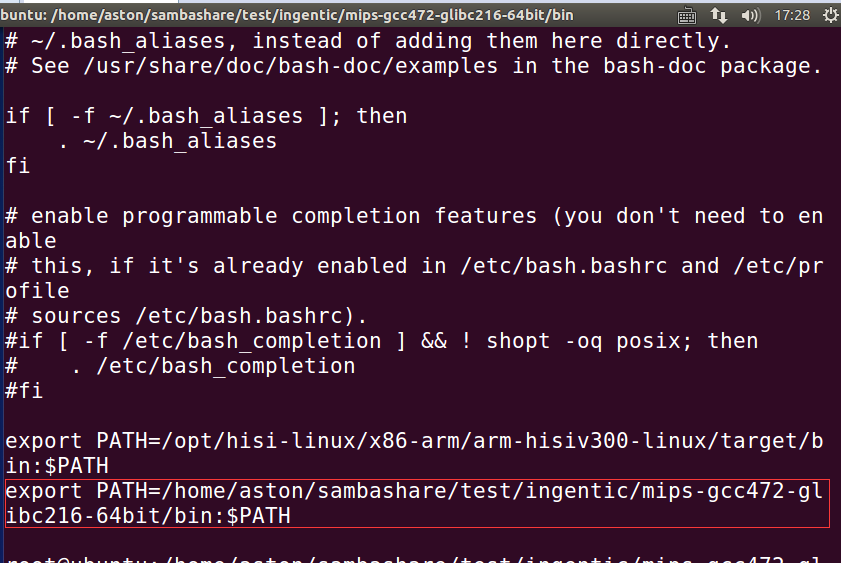
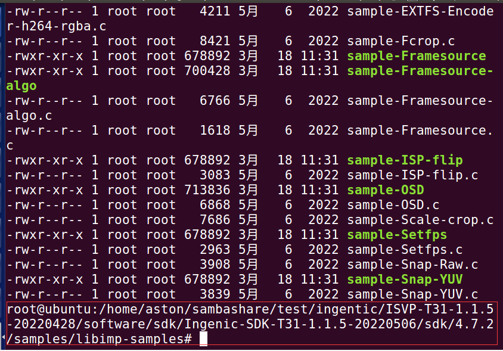
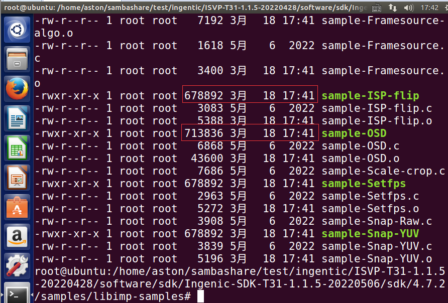

Ingenic T31 Application Layer Development
=========================================

How to Compile Sample
---------------------

### What is the Ingenic T31 application layer development?

Refers to the resources relying on the Ingenic T31 chip platform; the use of Ingenic linux system provides the API
to operate the process of hardware.

Why first speak Ingenic T31 application layer development, rather than first explain, uboot, kernel, root file system,
and file system?

Because most people go to the enterprise and will not be directly engaged in these jobs, and these jobs and the
application layer work is strictly separate, relatively difficult, it is easy to hit the confidence of beginners,
so this part I will stay until the end of the explanation, for the time being, you only need to use the system comes
with the file system for development can be.

### Ingenic T31 development environment

#### Why do we need to build the T31 development environment?

Due to the limited resources of the embedded single board, you cannot run the development and debugging tools on
the single board, usually you need to cross-compile debugging for development and debugging, that is 
[host](https://cloud.tencent.com/product/cdh).
The host and the target are usually used in the form of host+target machine.
The host and target are usually connected by a serial port for displaying interactive information and a network port
for transferring files.

However, the processors of the host and target are generally different. The host machine needs to establish a
cross-compilation environment suitable for the target machine. The program is compiled, connected and positioned
on the host to obtain an executable file. Through certain methods, the executable file will be burned into the 
target machine, and then run on the target machine.

The simple fact is that embedded devices have limited resources, such as memory, flash, etc., so we can't compile
the program directly on the embedded device.

#### Install the cross-compilation toolchain.

Get our cross-compilation toolchain `mips-gcc472-glibc216-64bit-r2.3.3.7z` from the SDK package.

Ubuntu 16.04 virtual machine installation process:

Step 1: Install 7z decompression tool 
```
sudo apt-get install p7zip
```

Step 2: Use the above software 7z to decompress
```
7z x mips-gcc472-glibc216-64bit.7z
```

You can clearly see the location of the decompressed cross-compilation toolchain.



Step 3: Add the bin directory under toolchain to the PATH environment variable or permanently change 
it by adding the following sentence to `~/.bashrc` with the command `export PATH=xxxx:$PATH`.

Show the absolute path of your installed cross-compilation toolchain with the pwd command and add it 
to the `.bashrc` file, so that the virtual machine will execute your condition every time it gets up
and then make your cross-compilation toolchain effective.



Step 4: Detect whether the cross-compilation toolchain is installed successfully or not.


### Compile Ingenic T31 sample files

Get `ISVP-T31-1.1.5-20220428.7z` SDK file from Ingenic bundle.

Use 7z unzip command to unzip the file and compile it inside the SDK. We go to the directory where we store the 
`SDK\ingenic\ISVP-T31-1.1.5-20220428\software\sdk\Ingenic-SDK-T31-1.1.5-20220506\sdk\4.7.2\samples\libimp-samples`



Just execute the make command directly.

You can see that after recompiling, the time of the cyan application has changed, proving that we compiled successfully.


