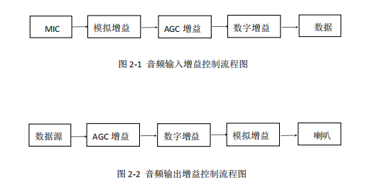
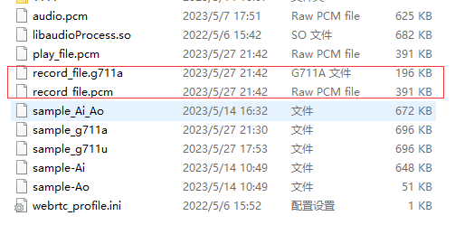

# [Ingenic T31 Application Development][toc]

Audio Coding and Decoding
-------------------------

### Why do we need audio codecs?

In the example mentioned earlier, we use Ingenic T31 devices are directly using API functions for
sound acquisition, and then directly playback of sound, which involves two sets of API, one is AI,
audio input function, and one is AO, audio output function.

The audio data captured here:

Through the AI interface, it is saved as the file audio.pcm.

Through the AO interface, by parsing the audio.pcm file.

The PCM file is relatively large. In some cases where the network bandwidth is not very good, the audio 
will be lost, resulting in audio lagging sound, so our side of the audio codec technology also came into being.

Generally, the audio codec data will be twice as small as the original data PCM file, G711A data format or AAC format file.




### Audio Codec APIs used by Ingenic


### Ingenic's Audio Codec Practice

Over here I bought a development board from the internet, roughly as shown below.


We modified the demo written in Ingenic's SDK, and then experimented with the following results;
you can see that the size of the same size recording audio file G711A is only about half the size of PCM.



#### Appendix Code

Functions used for coding:

```
static int IMP_Audio_Encode(void)
{
    char *buf_pcm = NULL;
    int ret = -1;

    buf_pcm = (char *)malloc(IMP_AUDIO_BUF_SIZE);
    if(buf_pcm == NULL) {
        IMP_LOG_ERR(TAG, "malloc audio pcm buf error\n");
        return -1;
    }

    FILE *file_pcm = fopen(IMP_AUDIO_RECORD_FILE, "rb");
    if(file_pcm == NULL) {
        IMP_LOG_ERR(TAG, "fopen %s failed\n", IMP_AUDIO_RECORD_FILE);
        return -1;
    }

    FILE *file_g711 = fopen(IMP_AUDIO_ENCODE_FILE, "wb");
    if(file_g711 == NULL) {
        IMP_LOG_ERR(TAG, "fopen %s failed\n", IMP_AUDIO_ENCODE_FILE);
        return -1;
    }

    /* my G711A encoder Register */
    int handle_g711a = 0;
    IMPAudioEncEncoder my_encoder;
    my_encoder.maxFrmLen = 1024;
    sprintf(my_encoder.name, "%s", "MY_G711A");
    my_encoder.openEncoder = NULL;
    my_encoder.encoderFrm = MY_G711A_Encode_Frm;
    my_encoder.closeEncoder = NULL;
    ret = IMP_AENC_RegisterEncoder(&handle_g711a, &my_encoder);
    if(ret != 0) {
        IMP_LOG_ERR(TAG, "IMP_AENC_RegisterEncoder failed\n");
        return -1;
    }

    /* my G711U encoder Register */
    int handle_g711u = 0;
    memset(&my_encoder, 0x0, sizeof(my_encoder));
    my_encoder.maxFrmLen = 1024;
    sprintf(my_encoder.name, "%s", "MY_G711U");
    my_encoder.openEncoder = NULL;
    my_encoder.encoderFrm = MY_G711U_Encode_Frm;
    my_encoder.closeEncoder = NULL;
    ret = IMP_AENC_RegisterEncoder(&handle_g711u, &my_encoder);
    if(ret != 0) {
        IMP_LOG_ERR(TAG, "IMP_AENC_RegisterEncoder failed\n");
        return -1;
    }

    /* audio encode create channel. */
    int AeChn = 0;
    IMPAudioEncChnAttr attr;
    attr.type = handle_g711a; /* Use the My method to encoder. if use the system method is attr.type = PT_G711A; */
    attr.bufSize = 20;
    ret = IMP_AENC_CreateChn(AeChn, &attr);
    if(ret != 0) {
        IMP_LOG_ERR(TAG, "imp audio encode create channel failed\n");
        return -1;
    }

    while(1) {
        ret = fread(buf_pcm, 1, IMP_AUDIO_BUF_SIZE, file_pcm);
        if(ret < IMP_AUDIO_BUF_SIZE)
            break;

        /* Send a frame to encode. */
        IMPAudioFrame frm;
        frm.virAddr = (uint32_t *)buf_pcm;
        frm.len = ret;
        ret = IMP_AENC_SendFrame(AeChn, &frm);
        if(ret != 0) {
            IMP_LOG_ERR(TAG, "imp audio encode send frame failed\n");
            return -1;
        }

        /* get audio encode frame. */
        IMPAudioStream stream;
        ret = IMP_AENC_PollingStream(AeChn, 1000);
        if (ret != 0) {
            IMP_LOG_ERR(TAG, "imp audio encode polling stream failed\n");
        }

        ret = IMP_AENC_GetStream(AeChn, &stream, BLOCK);
        if(ret != 0) {
            IMP_LOG_ERR(TAG, "imp audio encode get stream failed\n");
            return -1;
        }

        /* save the encode data to the file. */
        fwrite(stream.stream, 1, stream.len, file_g711);

        /* release stream. */
        ret = IMP_AENC_ReleaseStream(AeChn, &stream);
        if(ret != 0) {
            IMP_LOG_ERR(TAG, "imp audio encode release stream failed\n");
            return -1;
        }
    }

    ret = IMP_AENC_UnRegisterEncoder(&handle_g711a);
    if(ret != 0) {
        IMP_LOG_ERR(TAG, "IMP_AENC_UnRegisterEncoder failed\n");
        return -1;
    }

    ret = IMP_AENC_UnRegisterEncoder(&handle_g711u);
    if(ret != 0) {
        IMP_LOG_ERR(TAG, "IMP_AENC_UnRegisterEncoder failed\n");
        return -1;
    }

    /* destroy the encode channel. */
    ret = IMP_AENC_DestroyChn(AeChn);
    if(ret != 0) {
        IMP_LOG_ERR(TAG, "imp audio encode destroy channel failed\n");
        return -1;
    }

    fclose(file_pcm);
    fclose(file_g711);

    free(buf_pcm);
    return 0;
}
```

Functions used for decoding:

```
static int IMP_Audio_Decode(void)
{
    char *buf_g711 = NULL;
    int ret = -1;

    buf_g711 = (char *)malloc(IMP_AUDIO_BUF_SIZE);
    if(buf_g711 == NULL) {
        IMP_LOG_ERR(TAG, "[ERROR] %s: malloc audio g711 buf error\n", __func__);
        return -1;
    }

    FILE *file_pcm = fopen(IMP_AUDIO_PLAY_FILE, "wb");
    if(file_pcm == NULL) {
        IMP_LOG_ERR(TAG, "[ERROR] %s: fopen %s failed\n", __func__, IMP_AUDIO_PLAY_FILE);
        return -1;
    }

    FILE *file_g711 = fopen(IMP_AUDIO_ENCODE_FILE, "rb");
    if(file_g711 == NULL) {
        IMP_LOG_ERR(TAG, "[ERROR] %s: fopen %s failed\n", __func__, IMP_AUDIO_ENCODE_FILE);
        return -1;
    }

    /* My g711a decoder Register. */
    int handle_g711a = 0;
    IMPAudioDecDecoder my_decoder;
    sprintf(my_decoder.name, "%s", "MY_G711A");
    my_decoder.openDecoder = NULL;
    my_decoder.decodeFrm = MY_G711A_Decode_Frm;
    my_decoder.getFrmInfo = NULL;
    my_decoder.closeDecoder = NULL;

    ret = IMP_ADEC_RegisterDecoder(&handle_g711a, &my_decoder);
    if(ret != 0) {
        IMP_LOG_ERR(TAG, "IMP_ADEC_RegisterDecoder failed\n");
        return -1;
    }

    /* My g711u decoder Register. */
    int handle_g711u = 0;
    memset(&my_decoder, 0x0, sizeof(my_decoder));
    sprintf(my_decoder.name, "%s", "MY_G711U");
    my_decoder.openDecoder = NULL;
    my_decoder.decodeFrm = MY_G711U_Decode_Frm;
    my_decoder.getFrmInfo = NULL;
    my_decoder.closeDecoder = NULL;

    ret = IMP_ADEC_RegisterDecoder(&handle_g711u, &my_decoder);
    if(ret != 0) {
        IMP_LOG_ERR(TAG, "IMP_ADEC_RegisterDecoder failed\n");
        return -1;
    }

    /* audio decoder create channel. */
    int adChn = 0;
    IMPAudioDecChnAttr attr;
    attr.type = handle_g711a;
    attr.bufSize = 20;
    attr.mode = ADEC_MODE_PACK;
    ret = IMP_ADEC_CreateChn(adChn, &attr);
    if(ret != 0) {
        IMP_LOG_ERR(TAG, "imp audio decoder create channel failed\n");
        return -1;
    }

    ret = IMP_ADEC_ClearChnBuf(adChn);
    if(ret != 0) {
        IMP_LOG_ERR(TAG, "IMP_ADEC_ClearChnBuf failed\n");
        return -1;
    }

    while(1) {
        ret = fread(buf_g711, 1, IMP_AUDIO_BUF_SIZE/2, file_g711);
        if(ret < IMP_AUDIO_BUF_SIZE/2)
            break;

        /* Send a frame to decoder. */
        IMPAudioStream stream_in;
        stream_in.stream = (uint8_t *)buf_g711;
        stream_in.len = ret;
        ret = IMP_ADEC_SendStream(adChn, &stream_in, BLOCK);
        if(ret != 0) {
            IMP_LOG_ERR(TAG, "imp audio encode send frame failed\n");
            return -1;
        }

        /* get audio decoder frame. */
        IMPAudioStream stream_out;
        ret = IMP_ADEC_PollingStream(adChn, 1000);
        if(ret != 0) {
            IMP_LOG_ERR(TAG, "imp audio encode polling stream failed\n");
        }

        ret = IMP_ADEC_GetStream(adChn, &stream_out, BLOCK);
        if(ret != 0) {
            IMP_LOG_ERR(TAG, "imp audio decoder get stream failed\n");
            return -1;
        }

        /* save the decoder data to the file. */
        fwrite(stream_out.stream, 1, stream_out.len, file_pcm);

        /* release stream. */
        ret = IMP_ADEC_ReleaseStream(adChn, &stream_out);
        if(ret != 0) {
            IMP_LOG_ERR(TAG, "imp audio decoder release stream failed\n");
            return -1;
        }
    }

    ret = IMP_ADEC_UnRegisterDecoder(&handle_g711a);
    if(ret != 0) {
        IMP_LOG_ERR(TAG, "IMP_ADEC_UnRegisterDecoder failed\n");
        return -1;
    }

    ret = IMP_ADEC_UnRegisterDecoder(&handle_g711u);
    if(ret != 0) {
        IMP_LOG_ERR(TAG, "IMP_ADEC_UnRegisterDecoder failed\n");
        return -1;
    }

    /* destroy the decoder channel. */
    ret = IMP_ADEC_DestroyChn(adChn);
    if(ret != 0) {
        IMP_LOG_ERR(TAG, "imp audio decoder destroy channel failed\n");
        return -1;
    }

    fclose(file_pcm);
    fclose(file_g711);

    free(buf_g711);
    return 0;
}
```

### On follow-up

I will continue to update this T31 series, the next may have the corresponding development exchange group.

Into the group will not be free, because I used to do other groups when free will have a lot of hyper elite inside,
there are also a lot of white whoring party download the resources without saying a word, delete the group to run 
away people. Maybe five dollars to enter the group fee, this fee is a great limit to exclude that group of people out.

After I finish organizing the information, I will release the group number.

PS:

For the salary in the monthly salary of more than 20,000 people, this group is actually prohibited to go in,
because if you reach 20,000, or even more than 30,000, do embedded this line, you want a higher salary, 
you may need to specialize in the direction of the algorithm. You enter this group also no one to help you 
solve industry problems, unless you are beautiful.

This group is very suitable for undergraduate students who are not 985-211, if it is a freshman will be more
suitable, because you do not have any direction in the university, someone to you to push a hand, after you 
graduate to find a job will have a very big help.

As for the salary of this line, all students go to MileagePlus, BOSS direct employment to search for keywords:
embedded software engineer, IPC, NVR can be. Because I said you will not believe, you can search by yourself.

[toc]: index.md
