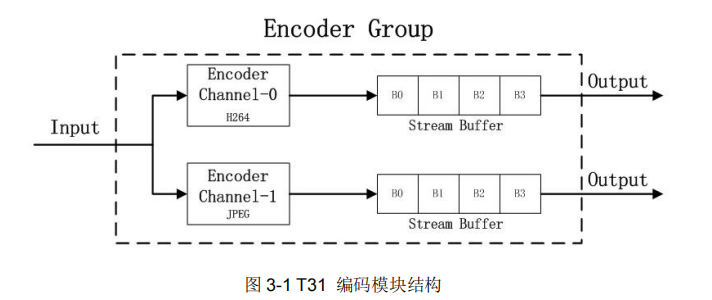
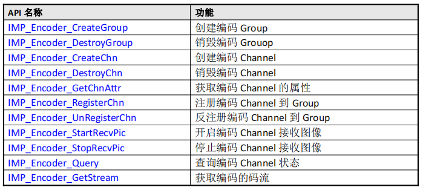

# [Ingenic T31 Application Development][toc]

The Basics of Video
-------------------

### Common encoding formats for video

The main coding formats for audio and video are H264 and H265.

Among them, H265 encoding format compression level is even greater, so the current commonly used 
IPC and NVR devices are using H265 encoding format.

But H264 because of the early development of earlier, most of the open-source projects support 
the format are H264 coding format, so many devices require you to have the ability to switch 
the coding format.

Specifically, what is H264 and what is H265 format, specific protocol header, protocol content,
many bloggers have a detailed description, I will not continue to summarize. But my side of the
back of the recommended view format of the software, will also show.

### Junzheng's video encoding module

The video encoding (JPEG, H264, H265) module mainly provides functions such as creating and 
destroying video encoding channels, turning on and stopping the reception of images, setting
and obtaining the properties of encoding channels, and obtaining and releasing streams, etc.
This module supports multichannel real-time encoding, and each channel is independent, and 
you can set up different encoding protocols and profiles.

Ingenic supports the encoding module of JPEG, H264 and H265 formats.

That is to say, we can get the data of these three formats through the demo provided by Ingenic.

Among them, we are docking large projects, in addition to these three formats, need to call back
to the upper layer, we also need to get the YUV stream, because this can be used elsewhere, later
I will also be reflected in my large projects. (Large projects are used at the enterprise level, 
i.e., things that are written on other people's job requirements)

There are three demos in here, corresponding to the way Junzheng gets the three code stream calls.

Block diagram of Ingenic's video coding:

The encoding module consists of Nogan Groups, each Group consists of an encoding Channel, and an
encoding Channel is accompanied by an output stream buffer, which consists of multiple buffers.

### Basic concepts related to video

Bit Rate Control:

__CBR__ - Constant Bit Rate, i.e., the encoding bit rate is constant during the bit rate statistics time.

Take H.264 encoding as an example, users can set maxQp, minQp, bitrate, etc. maxQp, minQp are used to control the image quality range.

maxQp, minQp are used to control the quality range of the image.

__VBR__ - Variable Bit Rate.

We usually use CBR more in the process of practical application.

__VPS__ - video parameter set.

__SPS__ - Sequence Parameter Set.

__PPS__ - the set of image parameters.

### Some of the Junzheng image encoding module APIs.

### Video Source Module

#### Function Description

VideoSource is an image data source for the IMP system, which allows you to set the image resolution, 
crop, scale, and other attributes, as well as the back-end noise reduction function.

FrameSource is a data stream related concept, which can set the image resolution, format, etc. and
provide the original image to the backend.

The structure of FrameSource is shown in the figure below:

Generally, we use the primary stream and the secondary stream.

Channel0 is generally used as HD video stream

Channel1 is generally used as SD video stream, or the data source of IVS intelligent algorithm.

Channel2 is an extended channel, used in special applications, and is generally not recommended.

#### Module Operation Flow

Init - initialization process:

1. Create channel
2. Set the channel
3. Enable channel

Exit - exit process:

1. Disable channel
2. Logout channel

#### FrameSource module partial API:

[toc]: index.md
