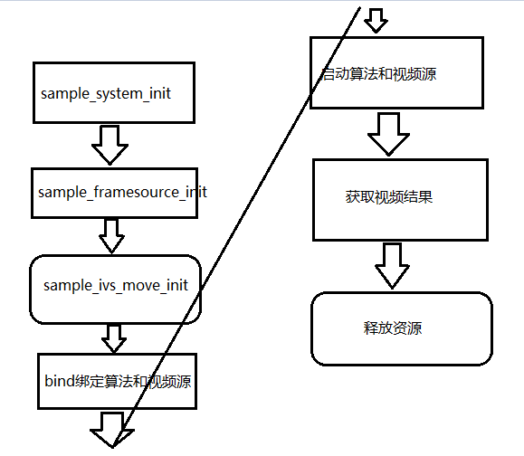
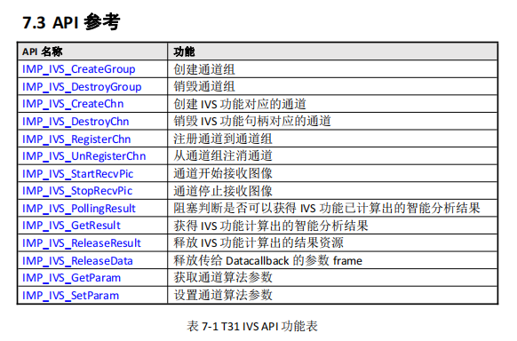

# [Ingenic T31 Application Development][toc]

Intelligent Detection Algorithm 
-------------------------------

### What is the intelligent detection algorithm?

We will see a variety of cameras (IPC) on Taobao, some are 99 RMB, some are 1000 RMB, such as the camera of Yuntian Reedfine.

Why is the price difference so huge?

Answer: Intelligent algorithm integration leads to different chip prices, which then leads to a huge difference in product prices.

For example, some time ago, XX pass released a car shape detection algorithm, his price is a penny, his shipments are estimated to be tens of millions of a year may be there, and here there are 100,000 dollars. In fact, this algorithm is the chip comes with, at least T41 comes with free, only the chip price is much more expensive than T31.

Most smart algorithms for detection have a few main components:
- 
- Motion detection algorithm.
- Sound detection algorithm.
- Cry detection algorithm.
- Vehicle detection algorithms.
- Humanoid detection algorithms.
- Face recognition algorithm.
- and so on.

The T31 chip belongs to the entry-level chip, so it doesn't integrate so many algorithms, 
and there are only three algorithms that can be done at present.

Motion detection algorithm, human shape detection algorithm, sound detection algorithm.

The following T31 sample to tell how the Ingenic platform calls the IVS intelligent detection platform.


### Ingenic's Intelligent Algorithm Inspection Platform

#### Use the steps:

IMP embeds intelligent analysis algorithms into the SDK by calling the instantiated `IMPIVSInterface` 
through IVS's generic interface API to analyze the frame images in the SDK.

`IMPIVSInterface` is a generic algorithm interface that is implemented by a specific algorithm and
passed to IMP IVS for the purpose of running the specific algorithm in the SDK.

A channel is a carrier for a single example algorithm, and the specific implementation of the algorithm
interface must be passed to the specific channel in order to run the algorithm in the SDK.

The `IMPIVSInterface` member param is an argument to the member function init.

IMP IVS will externally lock the frame passed to member function `ProcessAsync` parameter, 
`ProcessAsync` must call `IMP_IVS_ReleaseData` to release the frame after using the frame to avoid deadlock.

In addition to the above algorithm call by binding the IMP IVS in the data stream, we also provide
an unbound way to realize the algorithm call, that is, to get the frame image of framesouce channel
and directly call the member function of IMPIVSInterface to realize the algorithm processing.

In most cases, we use the unbound way to get the motion detection algorithm.


#### Algorithmic Usage of Binding Patterns:




#### Unbundled Mode Calling IVS Platforms


### APIs for intelligent algorithms




### Key Code Analysis

#### `sample_ivs_move_init`

Create IVS specific algorithm channel groups, multiple algorithms can share a channel group 
or use separate channel groups `sample_ivs_move_init();`

```
static int sample_ivs_move_init(int grp_num)
{
    int ret = 0;

    ret = IMP_IVS_CreateGroup(grp_num);
    if (ret < 0) {
        IMP_LOG_ERR(TAG, "IMP_IVS_CreateGroup(%d) failed\n", grp_num);
        return -1;
    }
    return 0;
}
```


#### `sample_ivs_move_start`

Here we pass in the value of the group is 0, that is, just initialized the value of the group of IVS,
and then we enter the encoding channel is 2, that is, we use the sub-stream for analysis, because the
T31 arithmetic is not too good, so we use the sub-stream for analysis, otherwise we will not have 
enough memory allocated, remember, embedded devices and PC software with the PC side of the biggest
difference is that the embedded devices Most of the resources are not enough.

The most important functions inside is `IMP_IVS_CreateMoveInterface`

How to set the parameters of motion detection?

```
/**
 * @file
 * IMP IVS Motion Detection Module
 */

/**
 * @defgroup MoveDetection
 * @ingroup IMP_IVS
 * @brief Motion Detection Interface
 * @{
 */

/**
 * Input structure for motion detection algorithm
 */
typedef struct {
    int             sense[IMP_IVS_MOVE_MAX_ROI_CNT];   /**< Motion detection sensitivity, range 0-4 for normal cameras, 0-8 for panoramic cameras */
    int             skipFrameCnt;                      /*< Number of inter-frame detections */
    IMPFrameInfo    frameInfo;                         /**< Frame size information, only width and height need to be configured. */
    IMPRect         roiRect[IMP_IVS_MOVE_MAX_ROI_CNT]; /*< Coordinate information of the ROI area to be detected */
    int             roiRectCnt;                        /*< The number of ROI to be detected, the range is 0-51, 
                                                           if 0 - no detection,
                                                           1 - detect roiRect 0 region, 
                                                           2 - detect roiRect 0,1 region,
                                                           3 - detect roiRect 0,1,2 region, and so on */
} IMP_IVS_MoveParam;
```

Set the motion detection parameters:

```
    IMP_IVS_MoveParam param;
    int i = 0, j = 0;

    memset(&param, 0, sizeof(IMP_IVS_MoveParam));
    //Set the detection interval to 5.
    param.skipFrameCnt = 5;
    param.frameInfo.width = SENSOR_WIDTH_SECOND;
    param.frameInfo.height = SENSOR_HEIGHT_SECOND;
    //Set detection area to 1 area  
    param.roiRectCnt = 1;
    //Set the sensitivity of all areas detected to 4, the highest sensitivity 
    for(i=0; i<param.roiRectCnt; i++){
        param.sense[i] = 4;
    }

    //Set the range of motion detection, it should be the same as humanoid detection, both have the function of area detection.
    /* printf("param.sense=%d, param.skipFrameCnt=%d, param.frameInfo.width=%d, param.frameInfo.height=%d\n", param.sense, param.skipFrameCnt, param.frameInfo.width, param.frameInfo.height); */
    for (j = 0; j < 2; j++) {
        for (i = 0; i < 2; i++) {
            if((i==0)&&(j==0))
            {
                param.roiRect[j * 2 + i].p0.x = i * param.frameInfo.width /* / 2 */;
                param.roiRect[j * 2 + i].p0.y = j * param.frameInfo.height /* / 2 */;
                param.roiRect[j * 2 + i].p1.x = (i + 1) * param.frameInfo.width /* / 2 */ - 1;
                param.roiRect[j * 2 + i].p1.y = (j + 1) * param.frameInfo.height /* / 2 */ - 1;
                printf("(%d,%d) = ((%d,%d)-(%d,%d))\n", i, j, param.roiRect[j * 2 + i].p0.x, param.roiRect[j * 2 + i].p0.y,param.roiRect[j * 2 + i].p1.x, param.roiRect[j * 2 + i].p1.y);
            }
            else
            {
                param.roiRect[j * 2 + i].p0.x = param.roiRect[0].p0.x;
                param.roiRect[j * 2 + i].p0.y = param.roiRect[0].p0.y;
                param.roiRect[j * 2 + i].p1.x = param.roiRect[0].p1.x;;
                param.roiRect[j * 2 + i].p1.y = param.roiRect[0].p1.y;;
                printf("(%d,%d) = ((%d,%d)-(%d,%d))\n", i, j, param.roiRect[j * 2 + i].p0.x, param.roiRect[j * 2 + i].p0.y,param.roiRect[j * 2 + i].p1.x, param.roiRect[j * 2 + i].p1.y);
            }
        }
    }
```

```
static int sample_ivs_move_start(int grp_num, int chn_num, IMPIVSInterface **interface)
{
    int ret = 0;
    IMP_IVS_MoveParam param;
    int i = 0, j = 0;

    memset(&param, 0, sizeof(IMP_IVS_MoveParam));
    param.skipFrameCnt = 5;
    param.frameInfo.width = SENSOR_WIDTH_SECOND;
    param.frameInfo.height = SENSOR_HEIGHT_SECOND;
    param.roiRectCnt = 1;

    for(i=0; i<param.roiRectCnt; i++){
      param.sense[i] = 4;
    }

    /* printf("param.sense=%d, param.skipFrameCnt=%d, param.frameInfo.width=%d, param.frameInfo.height=%d\n", param.sense, param.skipFrameCnt, param.frameInfo.width, param.frameInfo.height); */
    for (j = 0; j < 2; j++) {
        for (i = 0; i < 2; i++) {
            if((i==0)&&(j==0)){
                param.roiRect[j * 2 + i].p0.x = i * param.frameInfo.width /* / 2 */;
                param.roiRect[j * 2 + i].p0.y = j * param.frameInfo.height /* / 2 */;
                param.roiRect[j * 2 + i].p1.x = (i + 1) * param.frameInfo.width /* / 2 */ - 1;
                param.roiRect[j * 2 + i].p1.y = (j + 1) * param.frameInfo.height /* / 2 */ - 1;
                printf("(%d,%d) = ((%d,%d)-(%d,%d))\n", i, j, param.roiRect[j * 2 + i].p0.x, param.roiRect[j * 2 + i].p0.y,param.roiRect[j * 2 + i].p1.x, param.roiRect[j * 2 + i].p1.y);
            }
            else
            {
                param.roiRect[j * 2 + i].p0.x = param.roiRect[0].p0.x;
                param.roiRect[j * 2 + i].p0.y = param.roiRect[0].p0.y;
                param.roiRect[j * 2 + i].p1.x = param.roiRect[0].p1.x;;
                param.roiRect[j * 2 + i].p1.y = param.roiRect[0].p1.y;;
                printf("(%d,%d) = ((%d,%d)-(%d,%d))\n", i, j, param.roiRect[j * 2 + i].p0.x, param.roiRect[j * 2 + i].p0.y,param.roiRect[j * 2 + i].p1.x, param.roiRect[j * 2 + i].p1.y);
            }
        }
    }

    *interface = IMP_IVS_CreateMoveInterface(&param);
    if (*interface == NULL) {
        IMP_LOG_ERR(TAG, "IMP_IVS_CreateGroup(%d) failed\n", grp_num);
        return -1;
    }

    ret = IMP_IVS_CreateChn(chn_num, *interface);
    if (ret < 0) {
        IMP_LOG_ERR(TAG, "IMP_IVS_CreateChn(%d) failed\n", chn_num);
        return -1;
    }

    ret = IMP_IVS_RegisterChn(grp_num, chn_num);
    if (ret < 0) {
        IMP_LOG_ERR(TAG, "IMP_IVS_RegisterChn(%d, %d) failed\n", grp_num, chn_num);
        return -1;
    }

    ret = IMP_IVS_StartRecvPic(chn_num);
    if (ret < 0) {
        IMP_LOG_ERR(TAG, "IMP_IVS_StartRecvPic(%d) failed\n", chn_num);
        return -1;
    }

    return 0;
}
```


#### Get the result of the move detection with `sample_ivs_move_get_result_start`

The top few functions:

```
/**
 * Blocking determines whether or not the IVS function has access 
 * to the intelligent analytics that have already been calculated
 *
 * @fn int IMP_IVS_PollingResult(int ChnNum, int timeoutMs);
 *
 * @param[in]  ChnNum   Channel number corresponding to IVS function
 *
 * @param[in]  timeout  Maximum wait time in ms; 
 *                      IMP_IVS_DEFAULT_TIMEOUTMS: library internal default wait time,
 *                      0: no wait,
 *                      >0: user set wait time
 *
 * @retval 0   success
 * @retval -1  failure
 *
 * @remark     This Polling function returns success only if the ProcessAsync 
 *             function member of the IMPIVSInterface structure parameterized
 *             at the time the channel was created returns 0, i.e., 
 *             if the actual test returns normally.
 *
 * @attention  none
 */
int IMP_IVS_PollingResult(int ChnNum, int timeoutMs);
```

```
/**
 * Access to intelligent analytics calculated by the IVS function
 *
 * @fn int IMP_IVS_GetResult(int ChnNum, void **result);
 *
 * @param[in]  ChnNum  Channel number corresponding to IVS function
 *
 * @param[in]  result  The output of the channel number corresponding to the IVS
 *                     function returns a pointer to the result of the Intelligent
 *                     Analysis Algorithm corresponding to this channel, and no 
 *                     space is required to be allocated by external clients.
 *
 * @retval 0   success
 * @retval -1  failure
 *
 * @remark     According to the channels bound to different IVS functions, 
 *             the corresponding results are output.
 *
 * @attention 无
 */
int IMP_IVS_GetResult(int ChnNum, void **result);
```

```
/**
 * Releasing the resultant resources calculated by the IVS function
 *
 * @fn int IMP_IVS_ReleaseResult(int ChnNum, void *result);
 *
 * @param[in]  GrpNum  channel group number
 *
 * @param[in]  ChnNum  Channel number corresponding to IVS function
 *
 * @param[in]  result  Output of the channel number corresponding to the IVS function
 *
 * @retval 0   success
 * @retval -1  failure
 *
 * @remark     Depending on the channel bound to the different IVS functions, 
 *             the resultant resources of their outputs are released.
 *
 * @attention 无
 */
int IMP_IVS_ReleaseResult(int ChnNum, void *result);
```

Finally, you can write the code to get the motion detection:

```
static void *sample_ivs_move_get_result_process(void *arg)
{
    int i = 0, ret = 0;
    int chn_num = (int)arg;
    IMP_IVS_MoveOutput *result = NULL;

    for (i = 0; i < NR_FRAMES_TO_SAVE; i++) {
        ret = IMP_IVS_PollingResult(chn_num, IMP_IVS_DEFAULT_TIMEOUTMS);
        if (ret < 0) {
            IMP_LOG_ERR(TAG, "IMP_IVS_PollingResult(%d, %d) failed\n", chn_num, IMP_IVS_DEFAULT_TIMEOUTMS);
            return (void *)-1;
        }
        ret = IMP_IVS_GetResult(chn_num, (void **)&result);
        if (ret < 0) {
            IMP_LOG_ERR(TAG, "IMP_IVS_GetResult(%d) failed\n", chn_num);
            return (void *)-1;
        }
        IMP_LOG_INFO(TAG, "frame[%d], result->retRoi(%d,%d,%d,%d)\n", i, result->retRoi[0], result->retRoi[1], result->retRoi[2], result->retRoi[3]);

        ret = IMP_IVS_ReleaseResult(chn_num, (void *)result);
        if (ret < 0) {
            IMP_LOG_ERR(TAG, "IMP_IVS_ReleaseResult(%d) failed\n", chn_num);
            return (void *)-1;
        }
}
```

#### Release resources needed for motion detection:

```
/* Exit sequence as follow */
/* Step.10 stop to get ivs move result */
ret = sample_ivs_move_get_result_stop(ivs_tid);
if (ret < 0) {
    IMP_LOG_ERR(TAG, "sample_ivs_move_get_result_stop failed\n");
    return -1;
}

/* Step.11 ivs move stop */
ret = sample_ivs_move_stop(2, inteface);
if (ret < 0) {
    IMP_LOG_ERR(TAG, "sample_ivs_move_stop(0) failed\n");
    return -1;
}
/* Step.12 Stream Off */
ret = sample_framesource_streamoff();
if (ret < 0) {
    IMP_LOG_ERR(TAG, "FrameSource StreamOff failed\n");
    return -1;
}
```

### Experimental phenomena:

We use the following function to get the motion detection data information and 
we can get the value we need from the return value side of the function.

Since we get our value from the first field, we only need to focus on the first
printed data.

If it is 1, it proves that the motion detection was triggered, and if it is 0,
it proves that there was no motion detection. The result of the experiment also
proves that when I put my hand over, it is 1, and if I don't put it over, it is 0.
The experiment is perfectly and successfully verified.

```
ret = IMP_IVS_GetResult(chn_num, (void **)&result);
if (ret < 0) {
    IMP_LOG_ERR(TAG, "IMP_IVS_GetResult(%d) failed\n", chn_num);
    return (void *)-1;
}
IMP_LOG_INFO(TAG, "frame[%d], result->retRoi(%d,%d,%d,%d)\n", i, result->retRoi[0], result->retRoi[1], result->retRoi[2], result->retRoi[3]);
```


[toc]: index.md
