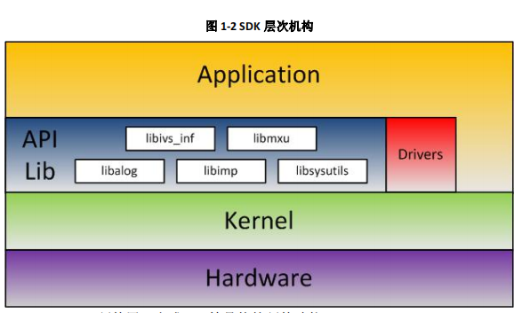

# 1.君正SDK概述

## 1.君正SDK概述

原创

**发布于** **2023-03-12 16:05:52**

**636**3

**举报**

## **1、什么是君正的SDK？**

ISVP SDK，即软件开发工具包，包括 API 库、开源源码、文档、Samples 等。开发

者可以通过 SDK 快速的开展产品功能开发。简单的来说，就是软件开发者用这个SDK开发产品。

​​

1.1、Tools:

其实就是平时我们使用的交叉编译工具链。（开发工作在虚拟机中使用）

ISP Tuning tools这个工具是用来调图的。

1.2、Document

就是我们开发所需要用到的文档，包含软件文档和硬件文档。

1.3、Resource

一些资源文件，比如根文件系统，HDK硬件开发资源。

1.4、lib：

软件开发库文件，使用这些库文件可以调用硬件的功能

包含，[音视频编解码](https://cloud.tencent.com/solution/x-insight?from_column=20065&from=20065)，ISP调图功能，OSD的水印功能

IVS的移动侦测功能。

1.5、opensource

君正原厂已经帮助我们开发好了uboot和kernel了，还有一些驱动需要我们自己根据自己需要编译。

1.6、sample

软件开发包的参考demo。大部分就是板极的开发包，包括君正系统库函数

## 2、我们开发的需要的层次？

一般来说，一个产品级别的项目，需要以下研发工作者（指的是实际干活的）

嵌入式软件工程师（驱动层），嵌入式软件工程师（应用层），硬件工程师，结构工程师。

​​

**建议大学生可以先学习嵌入式软件工程师（应用层）方向，这个部分对应上图的application部分。**

**调用君正芯片提供的系统级别的SDK的API结合sample进行功能的开发。**

**后续有开发经验了以后可以从事驱动层相关方向。**

● Hardware: 硬件层，完成 I/O 等具体的硬件功能。

● Linux Kernel: 内核层，完成基础的系统功能，定义硬件资源。

● drivers: ko 模块驱动，可通过 driver 进行硬件操作。

● API lib: 接口库，实现硬件功能的抽象，方便于应用层的开发。API 库主要有五部

分：

◆ libimp: 多媒体功能库。如 H264 编码，JPEG 编码，IVS 和 Audio 等。

◆ libsysutils: 系统功能库。如重启，设置系统时间和电池功能等。

◆ libalog: ISVP-SDK 的 log 实现库。

◆ libivs_inf: IVS 算法库，包括越线检测，周界防范等。

◆ libmxu: 128 位 mxu 加速指令算子库。

● Application: 应用层。实现功能逻辑等。

◆ Application 推荐使用 SDK 库提供的 API 及配合 drivers 进行开发。对于一些特

殊的功能需求，也可以直接调用内核接口进行开发。

原创声明：本文系作者授权腾讯云开发者社区发表，未经许可，不得转载。

如有侵权，请联系 [cloudcommunity@tencent.com](mailto:cloudcommunity@tencent.com) 删除。
