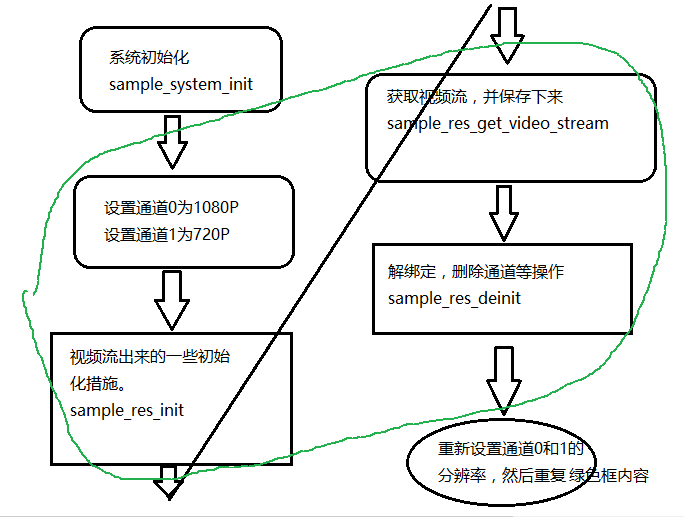
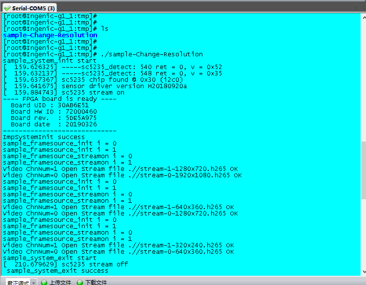

# 君正T31应用开发13：切换分辨率

## 君正T31应用开发13：切换分辨率

原创

**发布于** **2023-06-25 17:59:37**

**189**0

**举报**

# 1.视频分辨率是什么鬼东西？

一般我们买手机，电脑，只要和屏幕有关的东西的时候，都可以清晰的看到手机的参数是分辨率。

比如我现在用的这部手机是红米K40：分辨率是2400*1080，这代表有2592000这么多个像素。250万像素的手机屏幕，2400元的手机应该算很可以的配置了。

视频是一个工业化的产品，自然视频分辨率有自己的格式。

最常见的格式为1080P，720P，2K，4K等等。

4K：4096*2160，*4K的4096**3112分辨率等等。

分辨率的像素达到800万以上的像素，可以看清楚每一个细节。视频也不一定是分辨率越大也就越好的。

一般分辨率达到800万的设备用在网络上面的设备传输，需要极大的带宽，还有芯片的算力也要比平时的一些入门级别的算力要强很多。

2K：2K分辨率，指的是水平方向的像素达到2000以上的分辨率，主流的2K分辨率有

2560**1440以及2048**1080，不少的数字影院放映机主要采用的就是2K分辨率

相当于400万像素的设备。

1080P，1920*1080P，相当于200万像素的设备。

720P：1280*720P，相当于100万像素的设备。这也是早期IPC的主流分辨率。

​​

# 2.君正T31的切换分辨率demo

此例目的是将输出码流1080p+720p切换成720p+360p，再切换成360p+320x240，主、次码流均采用将encoder和framesource销毁重新创建的方法来切换分辨率。

​​

## 2.1：设置我们的初始分辨率

系统初始化函数+我们设置的初始化分辨率。

```
	/* Step.1 System init */
	ret = sample_system_init();
	if (ret < 0) {
		IMP_LOG_ERR(TAG, "IMP_System_Init() failed\n");
		return -1;
	}

	//init original resolution 1920x1080 & 1280x720
	chn[0].fs_chn_attr.scaler.enable = 0;
	chn[0].fs_chn_attr.crop.enable = 1;
	chn[0].fs_chn_attr.crop.top = 0;
	chn[0].fs_chn_attr.crop.left = 0;
	chn[0].fs_chn_attr.crop.width = 1920;
	chn[0].fs_chn_attr.crop.height = 1080;
	chn[0].fs_chn_attr.picWidth = 1920;
	chn[0].fs_chn_attr.picHeight = 1080;

	chn[1].fs_chn_attr.scaler.enable = 1;
	chn[1].fs_chn_attr.scaler.outwidth = 1280;
	chn[1].fs_chn_attr.scaler.outheight = 720;
	chn[1].fs_chn_attr.crop.enable = 0;
	chn[1].fs_chn_attr.picWidth = 1280;
	chn[1].fs_chn_attr.picHeight = 720;
```

复制

## 2.2：初始化视频源sample_res_init

跟原来的H265的编码是一样的，主要做了以下这几件事情。

1.初始化视频源函数

2.创建编码组

3.初始化编码器

4.把视频源把编码器绑定在一起

5.打开视频流

```
int sample_res_init()
{
	int ret, i;

	/* Step.2 FrameSource init */
	ret = sample_framesource_init();
	if (ret < 0) {
		IMP_LOG_ERR(TAG, "FrameSource init failed\n");
		return -1;
	}

	/* Step.3 Encoder init */
	for (i = 0; i < FS_CHN_NUM; i++) {
		if (chn[i].enable) {
			ret = IMP_Encoder_CreateGroup(chn[i].index);
			if (ret < 0) {
				IMP_LOG_ERR(TAG, "IMP_Encoder_CreateGroup(%d) error !\n", chn[i].index);
				return -1;
			}
		}
	}

	ret = sample_encoder_init();
	if (ret < 0) {
		IMP_LOG_ERR(TAG, "Encoder init failed\n");
		return -1;
	}

	/* Step.4 Bind */
	for (i = 0; i < FS_CHN_NUM; i++) {
		if (chn[i].enable) {
			ret = IMP_System_Bind(&chn[i].framesource_chn, &chn[i].imp_encoder);
			if (ret < 0) {
				IMP_LOG_ERR(TAG, "Bind FrameSource channel%d and Encoder failed\n",i);
				return -1;
			}
		}
	}

	/* Step.5 Stream On */
	ret = sample_framesource_streamon();
	if (ret < 0) {
		IMP_LOG_ERR(TAG, "ImpStreamOn failed\n");
		return -1;
	}
	return 0;
}
```

复制

## 2.3：获取视频流并销毁原来建立的通道数据sample_res_deinit

1.关闭视频流开关

2.解绑刚才绑定的视频源数据和编码数据

3.编码退出函数

4.视频源退出函数

```
int sample_res_deinit()
{
	int ret, i;
	/* Step.a Stream Off */
	ret = sample_framesource_streamoff();
	if (ret < 0) {
		IMP_LOG_ERR(TAG, "FrameSource StreamOff failed\n");
		return -1;
	}

	/* Step.b UnBind */
	for (i = 0; i < FS_CHN_NUM; i++) {
		if (chn[i].enable) {
			ret = IMP_System_UnBind(&chn[i].framesource_chn, &chn[i].imp_encoder);
			if (ret < 0) {
				IMP_LOG_ERR(TAG, "UnBind FrameSource channel%d and Encoder failed\n",i);
				return -1;
			}
		}
	}

	/* Step.c Encoder exit */
	ret = sample_encoder_exit();
	if (ret < 0) {
		IMP_LOG_ERR(TAG, "Encoder exit failed\n");
		return -1;
	}

	/* Step.d FrameSource exit */
	ret = sample_framesource_exit();
	if (ret < 0) {
		IMP_LOG_ERR(TAG, "FrameSource exit failed\n");
		return -1;
	}
	return 0;
}
```

复制

```
	ret = sample_res_get_video_stream();
	if (ret < 0) {
		IMP_LOG_ERR(TAG, "Get video stream failed\n");
		return -1;
	}

	ret = sample_res_deinit();
	if (ret < 0) {
		IMP_LOG_ERR(TAG, "sample_res_deinit failed\n");
		return -1;
	}
```

复制

## 2.4：重复上述的过程，这部分重新配置你的分辨率参数

```
	//change resolution to 1280x720 & 640x360
	chn[0].fs_chn_attr.scaler.enable = 1;
	chn[0].fs_chn_attr.scaler.outwidth = 1280;
	chn[0].fs_chn_attr.scaler.outheight = 720;
	chn[0].fs_chn_attr.crop.enable = 1;
	chn[0].fs_chn_attr.crop.top = 0;
	chn[0].fs_chn_attr.crop.left = 0;
	chn[0].fs_chn_attr.crop.width = 1280;
	chn[0].fs_chn_attr.crop.height = 720;
	chn[0].fs_chn_attr.picWidth = 1280;
	chn[0].fs_chn_attr.picHeight = 720;

	chn[1].fs_chn_attr.scaler.enable = 1;
	chn[1].fs_chn_attr.scaler.outwidth = 640;
	chn[1].fs_chn_attr.scaler.outheight = 360;
	chn[1].fs_chn_attr.crop.enable = 0;
	chn[1].fs_chn_attr.picWidth = 640;
	chn[1].fs_chn_attr.picHeight = 360;
```

复制

```
	ret = sample_res_init();
	if (ret < 0) {
		IMP_LOG_ERR(TAG, "sample_res_init failed\n");
		return -1;
	}

	ret = sample_res_get_video_stream();
	if (ret < 0) {
		IMP_LOG_ERR(TAG, "Get video stream failed\n");
		return -1;
	}

	ret = sample_res_deinit();
	if (ret < 0) {
		IMP_LOG_ERR(TAG, "sample_res_deinit failed\n");
		return -1;
	}
```

复制

# 3：实验现象：

首先我们设置分辨率为

第一步：通道0是1080P，通道1是720P

第二步：通道0是720P，通道1是320P

第三步：通道0是320P，通道1是320*240的分辨率。

由此可见我们在程序运行的过程中，成功实现了分辨率的切换的功能。

​​

原创声明：本文系作者授权腾讯云开发者社区发表，未经许可，不得转载。

如有侵权，请联系 [cloudcommunity@tencent.com](mailto:cloudcommunity@tencent.com) 删除。
