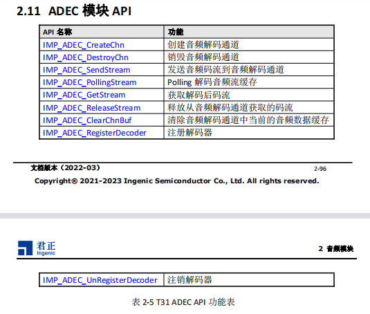
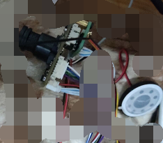

# 君正T31应用开发6：音频编解码

## 君正T31应用开发6：音频编解码

原创

**发布于** **2023-05-27 22:48:23**

**245**0

**举报**

# 1.为什么需要音频编解码？

前面提到的例子中，我们使用君正T31的设备都是直接使用API函数进行采集声音，然后直接播放声音的，其中涉及两组API，一组是AI，音频输入函数，一组是AO，音频输出函数。

这里面采集到的音频数据：

通过AI接口，保存为文件audio.pcm文件。

通过AO接口，通过解析audio.pcm文件。

这里面PCM的文件是比较大的，在某些网络带宽不是很好的情况下，可能音频桢会丢掉，导致音频出现卡顿的声音，所以我们这边音频编解码技术也就应运而生。

一般经过音频编解码的数据会比原始数据PCM文件小一倍，G711A数据格式或者AAC格式文件。

​​

​​

## 2.君正使用的音频编解码API

​​

​​

# 3.君正的音频编解码实战。

这边我从网络上买了一个开发板，大概如下图所示。

​​

稍微修改了君正的SDK里面写的demo,然后实验结果如下，可以看到同样大小的录制音频文件g711A的大小大概只有PCM大小的一半。

​​

附录代码：

编码使用的函数

```
static int IMP_Audio_Encode(void)
{
	char *buf_pcm = NULL;
	int ret = -1;

	buf_pcm = (char *)malloc(IMP_AUDIO_BUF_SIZE);
	if(buf_pcm == NULL) {
		IMP_LOG_ERR(TAG, "malloc audio pcm buf error\n");
		return -1;
	}

	FILE *file_pcm = fopen(IMP_AUDIO_RECORD_FILE, "rb");
	if(file_pcm == NULL) {
		IMP_LOG_ERR(TAG, "fopen %s failed\n", IMP_AUDIO_RECORD_FILE);
		return -1;
	}

	FILE *file_g711 = fopen(IMP_AUDIO_ENCODE_FILE, "wb");
	if(file_g711 == NULL) {
		IMP_LOG_ERR(TAG, "fopen %s failed\n", IMP_AUDIO_ENCODE_FILE);
		return -1;
	}

	/* my G711A encoder Register */
	int handle_g711a = 0;
	IMPAudioEncEncoder my_encoder;
	my_encoder.maxFrmLen = 1024;
	sprintf(my_encoder.name, "%s", "MY_G711A");
	my_encoder.openEncoder = NULL;
	my_encoder.encoderFrm = MY_G711A_Encode_Frm;
	my_encoder.closeEncoder = NULL;
	ret = IMP_AENC_RegisterEncoder(&handle_g711a, &my_encoder);
	if(ret != 0) {
		IMP_LOG_ERR(TAG, "IMP_AENC_RegisterEncoder failed\n");
		return -1;
	}

	/* my G711U encoder Register */
	int handle_g711u = 0;
	memset(&my_encoder, 0x0, sizeof(my_encoder));
	my_encoder.maxFrmLen = 1024;
	sprintf(my_encoder.name, "%s", "MY_G711U");
	my_encoder.openEncoder = NULL;
	my_encoder.encoderFrm = MY_G711U_Encode_Frm;
	my_encoder.closeEncoder = NULL;
	ret = IMP_AENC_RegisterEncoder(&handle_g711u, &my_encoder);
	if(ret != 0) {
		IMP_LOG_ERR(TAG, "IMP_AENC_RegisterEncoder failed\n");
		return -1;
	}

	/* audio encode create channel. */
	int AeChn = 0;
	IMPAudioEncChnAttr attr;
	attr.type = handle_g711a; /* Use the My method to encoder. if use the system method is attr.type = PT_G711A; */
	attr.bufSize = 20;
	ret = IMP_AENC_CreateChn(AeChn, &attr);
	if(ret != 0) {
		IMP_LOG_ERR(TAG, "imp audio encode create channel failed\n");
		return -1;
	}

	while(1) {
		ret = fread(buf_pcm, 1, IMP_AUDIO_BUF_SIZE, file_pcm);
		if(ret < IMP_AUDIO_BUF_SIZE)
			break;

		/* Send a frame to encode. */
		IMPAudioFrame frm;
		frm.virAddr = (uint32_t *)buf_pcm;
		frm.len = ret;
		ret = IMP_AENC_SendFrame(AeChn, &frm);
		if(ret != 0) {
			IMP_LOG_ERR(TAG, "imp audio encode send frame failed\n");
			return -1;
		}

		/* get audio encode frame. */
		IMPAudioStream stream;
		ret = IMP_AENC_PollingStream(AeChn, 1000);
		if (ret != 0) {
			IMP_LOG_ERR(TAG, "imp audio encode polling stream failed\n");
		}

		ret = IMP_AENC_GetStream(AeChn, &stream, BLOCK);
		if(ret != 0) {
			IMP_LOG_ERR(TAG, "imp audio encode get stream failed\n");
			return -1;
		}

		/* save the encode data to the file. */
		fwrite(stream.stream, 1, stream.len, file_g711);

		/* release stream. */
		ret = IMP_AENC_ReleaseStream(AeChn, &stream);
		if(ret != 0) {
			IMP_LOG_ERR(TAG, "imp audio encode release stream failed\n");
			return -1;
		}
	}

	ret = IMP_AENC_UnRegisterEncoder(&handle_g711a);
	if(ret != 0) {
		IMP_LOG_ERR(TAG, "IMP_AENC_UnRegisterEncoder failed\n");
		return -1;
	}

	ret = IMP_AENC_UnRegisterEncoder(&handle_g711u);
	if(ret != 0) {
		IMP_LOG_ERR(TAG, "IMP_AENC_UnRegisterEncoder failed\n");
		return -1;
	}

	/* destroy the encode channel. */
	ret = IMP_AENC_DestroyChn(AeChn);
	if(ret != 0) {
		IMP_LOG_ERR(TAG, "imp audio encode destroy channel failed\n");
		return -1;
	}

	fclose(file_pcm);
	fclose(file_g711);

	free(buf_pcm);
	return 0;
}
```

复制

解码使用的函数：

```
static int IMP_Audio_Decode(void)
{
	char *buf_g711 = NULL;
	int ret = -1;

	buf_g711 = (char *)malloc(IMP_AUDIO_BUF_SIZE);
	if(buf_g711 == NULL) {
		IMP_LOG_ERR(TAG, "[ERROR] %s: malloc audio g711 buf error\n", __func__);
		return -1;
	}

	FILE *file_pcm = fopen(IMP_AUDIO_PLAY_FILE, "wb");
	if(file_pcm == NULL) {
		IMP_LOG_ERR(TAG, "[ERROR] %s: fopen %s failed\n", __func__, IMP_AUDIO_PLAY_FILE);
		return -1;
	}

	FILE *file_g711 = fopen(IMP_AUDIO_ENCODE_FILE, "rb");
	if(file_g711 == NULL) {
		IMP_LOG_ERR(TAG, "[ERROR] %s: fopen %s failed\n", __func__, IMP_AUDIO_ENCODE_FILE);
		return -1;
	}

	/* My g711a decoder Register. */
	int handle_g711a = 0;
	IMPAudioDecDecoder my_decoder;
	sprintf(my_decoder.name, "%s", "MY_G711A");
	my_decoder.openDecoder = NULL;
	my_decoder.decodeFrm = MY_G711A_Decode_Frm;
	my_decoder.getFrmInfo = NULL;
	my_decoder.closeDecoder = NULL;

	ret = IMP_ADEC_RegisterDecoder(&handle_g711a, &my_decoder);
	if(ret != 0) {
		IMP_LOG_ERR(TAG, "IMP_ADEC_RegisterDecoder failed\n");
		return -1;
	}

	/* My g711u decoder Register. */
	int handle_g711u = 0;
	memset(&my_decoder, 0x0, sizeof(my_decoder));
	sprintf(my_decoder.name, "%s", "MY_G711U");
	my_decoder.openDecoder = NULL;
	my_decoder.decodeFrm = MY_G711U_Decode_Frm;
	my_decoder.getFrmInfo = NULL;
	my_decoder.closeDecoder = NULL;

	ret = IMP_ADEC_RegisterDecoder(&handle_g711u, &my_decoder);
	if(ret != 0) {
		IMP_LOG_ERR(TAG, "IMP_ADEC_RegisterDecoder failed\n");
		return -1;
	}

	/* audio decoder create channel. */
	int adChn = 0;
	IMPAudioDecChnAttr attr;
	attr.type = handle_g711a;
	attr.bufSize = 20;
	attr.mode = ADEC_MODE_PACK;
	ret = IMP_ADEC_CreateChn(adChn, &attr);
	if(ret != 0) {
		IMP_LOG_ERR(TAG, "imp audio decoder create channel failed\n");
		return -1;
	}

	ret = IMP_ADEC_ClearChnBuf(adChn);
	if(ret != 0) {
		IMP_LOG_ERR(TAG, "IMP_ADEC_ClearChnBuf failed\n");
		return -1;
	}

	while(1) {
		ret = fread(buf_g711, 1, IMP_AUDIO_BUF_SIZE/2, file_g711);
		if(ret < IMP_AUDIO_BUF_SIZE/2)
			break;

		/* Send a frame to decoder. */
		IMPAudioStream stream_in;
		stream_in.stream = (uint8_t *)buf_g711;
		stream_in.len = ret;
		ret = IMP_ADEC_SendStream(adChn, &stream_in, BLOCK);
		if(ret != 0) {
			IMP_LOG_ERR(TAG, "imp audio encode send frame failed\n");
			return -1;
		}

		/* get audio decoder frame. */
		IMPAudioStream stream_out;
		ret = IMP_ADEC_PollingStream(adChn, 1000);
		if(ret != 0) {
			IMP_LOG_ERR(TAG, "imp audio encode polling stream failed\n");
		}

		ret = IMP_ADEC_GetStream(adChn, &stream_out, BLOCK);
		if(ret != 0) {
			IMP_LOG_ERR(TAG, "imp audio decoder get stream failed\n");
			return -1;
		}

		/* save the decoder data to the file. */
		fwrite(stream_out.stream, 1, stream_out.len, file_pcm);

		/* release stream. */
		ret = IMP_ADEC_ReleaseStream(adChn, &stream_out);
		if(ret != 0) {
			IMP_LOG_ERR(TAG, "imp audio decoder release stream failed\n");
			return -1;
		}
	}

	ret = IMP_ADEC_UnRegisterDecoder(&handle_g711a);
	if(ret != 0) {
		IMP_LOG_ERR(TAG, "IMP_ADEC_UnRegisterDecoder failed\n");
		return -1;
	}

	ret = IMP_ADEC_UnRegisterDecoder(&handle_g711u);
	if(ret != 0) {
		IMP_LOG_ERR(TAG, "IMP_ADEC_UnRegisterDecoder failed\n");
		return -1;
	}

	/* destroy the decoder channel. */
	ret = IMP_ADEC_DestroyChn(adChn);
	if(ret != 0) {
		IMP_LOG_ERR(TAG, "imp audio decoder destroy channel failed\n");
		return -1;
	}

	fclose(file_pcm);
	fclose(file_g711);

	free(buf_g711);
	return 0;
}
```

复制

# 3.关于后续

这个T31系列我会继续更新下去，接下来可能会有相应的开发交流群。

进群的不会是免费的，因为以前我做别的群时候免费会有一大堆亢精进去里面，也有一大堆白嫖党下载完资源一句话不说，删群跑路的人。可能是五块钱的进群费用，这个费用就是极大限度的把那群人排除出去。

后续我整理完资料之后，就会发布群号。

PS：

对于工资在月薪2万以上的人，这个群其实禁止进去的，因为如果你达到2万，甚至3万以上了，做嵌入式这行，你想要更高的工资，你可能需要往算法的方向专研了。你进入这群也没有人去帮你解决行业难题，除非你是美女。

这群非常适合本科不是985-211的学生，如果是大一的新生就更加适合了，因为你在大学没有任何方向的时候，有人往你身上推一把，之后你毕业找工作会有十分大的助力。

至于这行的薪资，各位同学自行去前程无忧，BOSS直聘去搜索关键字：嵌入式软件工程师，IPC，NVR即可。因为我说的你们也不会相信，你们自行去搜索即可。

原创声明：本文系作者授权腾讯云开发者社区发表，未经许可，不得转载。

如有侵权，请联系 [cloudcommunity@tencent.com](mailto:cloudcommunity@tencent.com) 删除。
