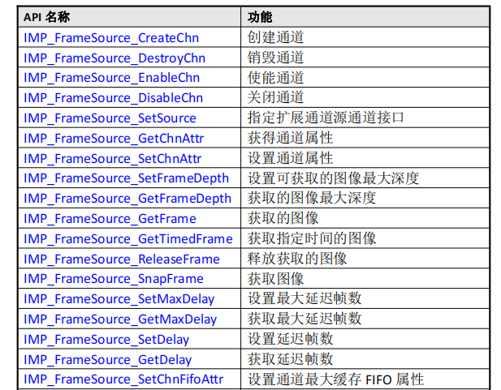

# 君正T31应用开发7：视频的基本知识

## 君正T31应用开发7：视频的基本知识

原创

**发布于** **2023-06-04 09:35:55**

**271**0

**举报**

# 1.视频的常见编码格式

音视频主要的编码格式分为H264和H265的编码格式。

其中H265的编码格式压缩水平更加大，所以目前常用的IPC和NVR设备都是使用H265编码格式。

但是H264因为早期开发的比较早，大部分的开源项目支持的格式都是H264的编码格式，所以目前很多设备要求你具备切换编码格式的能力。

具体什么是H264和什么是H265格式，具体的协议头，协议内容，很多博主都有详细的描述，我这边不会继续总结。不过我这边后面有推荐的查看格式的软件，也会展示出来。

# 2.君正的视频编码模块

视频编码（JPEG, H264, H265）模块，主要提供视频编码通道的创建和销毁、开启和停止接收图像、设置和获取编码通道属性、获取和释放 码流等功能本模块支持多路 实时编码，每路独立，且可以设置不同编码协议和 profile。

君正支持目前三种格式的编码模块JPEG，H264，H265格式的编码。

也就是说我们可以通过君正提供的demo得到这三种格式的数据。

其中，我们对接大型项目的时候，除了这三种格式需要回调到上层以外，我们还需要得到YUV的码流，因为这个可以用到别的地方，后期我也会在我的大型项目中有所体现。（大型项目都是企业级别使用的，也就是别人招聘要求上写的东西）

这里面有三个demo，分别对应君正获取三种码流的调用方式。

​​

君正的视频编码框图：

​​

编码模块由诺干个Group组成，每个Group由编码Channel组成，一个编码Channel附带一个输出码流缓冲区，这个缓冲区由多个buffer组成。

# 3.视频相关的基础概念

码率控制：

CBR：（Constent Bit Rate）恒定比特率，即在码率统计时间内编码码率恒定。

以 H.264 编码为例，用户可设置 maxQp，minQp，bitrate 等。

maxQp，minQp 用于控制图像的质量范围。

VBR：可变比特率。

我们一般在实际运用的过程中，都是使用CBR比较多的。

VPS：视频参数集。

SPS：序列参数集。

PPS：图像参数集。

# 4.部分君正图像编码模块的API

​​

​​

# 5.视频源模块：

## 5.1:功能介绍：

视频源，是 IMP 系统的图像数据源，可设置图像的分辨率、裁减、缩放等属性， 以及后端降噪功能

FrameSource 是一个数据流相关概念，可以设置图像分辨率，格式等，并向后端 提供原始图像。

FrameSource 的结构如下图：

一般我们使用的是主码流，以及次码流。

Channel0一般作为高清视频流

Channel1一般作为标清视频流，或者IVS智能算法的数据源。

Channel2是扩展通道，在特殊应用下使用，一般不建议使用。

## 5.2：模块操作流程

Init初始化流程

1.创建通道

2.设置通道

3.使能通道

Exit退出流程

1.失能通道

2.注销通道

## 5.3FrameSource模块部分API：

​​

原创声明：本文系作者授权腾讯云开发者社区发表，未经许可，不得转载。

如有侵权，请联系 [cloudcommunity@tencent.com](mailto:cloudcommunity@tencent.com) 删除。
