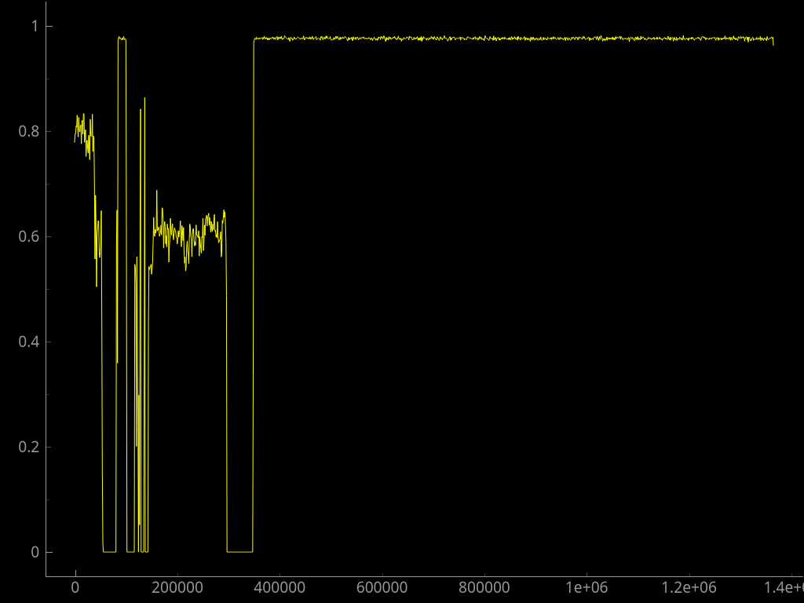
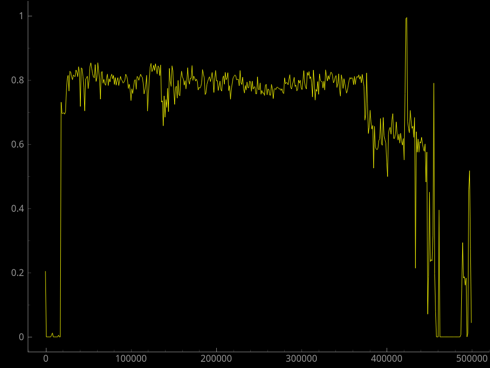
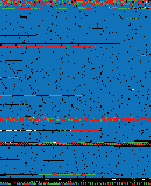
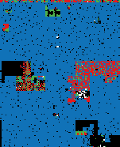
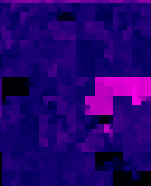

Binwalk Guide
-------------
by julian♦, from https://reverseengineering.stackexchange.com/a/15116

Running `binwalk` without any arguments other than the firmware binary file name
is equivalent to running it with the `-B` or `--signature` arguments, which 
directs binwalk to perform a signature scan. Since a signature scan is 
essentially search for particular byte sequences, false positives can occur
frequently, especially for short sequences. It is therefore important to verify
the output of a `binwalk` signature scan using a variety of methods to control 
for the possibility of false positives. Such methods include

- entropy analysis
- visualization
- examining a hex dump of the binary
- searching the binary for strings

The signature detected by `binwalk` in the question was one of LZMA-compressed
data, a compression method to which [an entire file is dedicated in the source
code][1] of `binwalk`.

### 1. Entropy Analysis

The fastest and easiest heuristic to use in making a determination whether there
really is an LZMA-compressed portion within `firmware.bin` is to use binwalk to
perform an entropy scan.

When it comes to compression (as well as other forms of obfuscation, such as
packing, encryption, encoding etc.), there are in general 3 possibilities:

- The entire binary is compressed
- Certain areas of the binary are compressed
- The binary contains no compression

Compression results in very high [information entropy][2] within the compressed
region. Compression can therefore be very easily spotted by looking for areas 
with an entropy level close to 1 in an entropy plot generated by `binwalk`.

Note that for the examples below the term "obfuscation" is used instead of 
"compression" because it is often [difficult to accurately differentiate between
compression, encryption][3], etc just by using entropy analysis.

Note also that when analyzing firmware, entropy close to 1 is a strong indicator,
not a guarantee, of obfuscation. This is because firmware binaries sometimes 
contain embedded image files such as JPEGs, which have high entropy. Confounding
factors like embedded image files reduce the accuracy of entropy scans in 
locating regions within the binary that are truly compressed (or obfuscated).

Example 1: The entire binary is obfuscated


The flat, straight line indicates that the entropy level is very close to 1 
throughout the entire binary, indicating that there are no unobfuscated regions.

Example 2: Certain areas of the binary are obfuscated



In this firmware binary there are 2 obfuscated regions: one beginning at offset 
~8000 decimal and ending at offset ~10000 decimal, and another extending from 
offset ~35000 to EOF.

Example 3: The binary contains no obfuscation 


The maximum level of information entropy in this plot is approximately .7, which
is inconsistent with obfuscation.

Entropy plot of firmware.bin:



Entropy analysis output:

```
$ binwalk -E firmware.bin

DECIMAL       HEXADECIMAL     ENTROPY
--------------------------------------------------------------------------------
0             0x0             Falling entropy edge (0.204084)
54272         0xD400          Falling entropy edge (0.836558)
62464         0xF400          Falling entropy edge (0.828255)
124928        0x1E800         Falling entropy edge (0.825872)
130048        0x1FC00         Falling entropy edge (0.836094)
422912        0x67400         Rising entropy edge (0.991258)   <---- spike
424960        0x67C00         Falling entropy edge (0.670723)
```

There is a spike in entropy level at 0x67400 that reaches close to 1, but this 
is at a different location in the binary from the offset at which the LZMA 
compression signature was detected, `0x6EE50`:

```
454224        0x6EE50         LZMA compressed data, properties: 0x6C, dictionary size: 33554432 bytes, uncompressed size: 3468924096053250820 bytes
```

This casts doubt on the accuracy of the signature scan output.

### 2. Visualization

Visualization can be used to very quickly get a sense of the layout of a binary.
An entropy plot is arguably one type of visualization: since code and data have 
different entropy levels, an entropy plot can be used to get a sense of the 
layout of a binary. For example, file headers typically have low entropy, code
has fairly high entropy, and ASCII data has an entropy level between the two.

##### Visualization of firmware.bin using [binvis.io](http://binvis.io/#/):

Note: blue is ASCII data, pink is entropy close to 1.


These images reveal something interesting which was not obvious from the entropy
plot: there appears to be an obfuscated block of data in the binary within the
same region that ASCII data is concentrated. The pictures below are zoomed in on
this region:






This possibly obfuscated block is located at the offset of the entropy spike in
the plot:


This specific region can be more closely scrutinized with `hexdump`.

### 3. Ye Olde Eyeballs + a Hex Dump

Firmware binaries can be quite large, but often only certain parts will be
interesting enough to merit direct inspection. Inspection of regions of a 
binary using a hex dump can also provide some context for what is going on
at particular offsets.

In the case of `firmware.bin`, the possibly obfuscated block and the region
around it can be directly inspected using the the following command:

```
hexdump -C -s 422000 -n 4096 firmware.bin | less
```

The `-s` argument skips the specified number of bytes (in decimal), which is
especially useful when working with large files.

##### Dump of area around 0x67400:

```
000672c0  00 00 00 00 00 00 63 6f  6e 6e 65 63 74 69 6e 67  |......connecting|
000672d0  20 74 6f 20 22 25 73 22  20 66 61 69 6c 65 64 20  | to "%s" failed |
000672e0  28 25 64 2f 25 64 29 00  45 72 72 6f 72 20 61 74  |(%d/%d).Error at|
000672f0  3a 20 25 73 2c 20 25 64  0a 00 63 72 79 70 74 6f  |: %s, %d..crypto|
00067300  2f 73 72 63 2f 77 6d 63  72 79 70 74 6f 5f 6d 65  |/src/wmcrypto_me|
00067310  6d 2e 63 00 a5 63 63 c6  84 7c 7c f8 99 77 77 ee  |m.c..cc..||..ww.| <- beginning of obfuscated block
00067320  8d 7b 7b f6 0d f2 f2 ff  bd 6b 6b d6 b1 6f 6f de  |.{{......kk..oo.|
00067330  54 c5 c5 91 50 30 30 60  03 01 01 02 a9 67 67 ce  |T...P00`.....gg.|
00067340  7d 2b 2b 56 19 fe fe e7  62 d7 d7 b5 e6 ab ab 4d  |}++V....b......M|
00067350  9a 76 76 ec 45 ca ca 8f  9d 82 82 1f 40 c9 c9 89  |.vv.E.......@...|
00067360  87 7d 7d fa 15 fa fa ef  eb 59 59 b2 c9 47 47 8e  |.}}......YY..GG.|
00067370  0b f0 f0 fb ec ad ad 41  67 d4 d4 b3 fd a2 a2 5f  |.......Ag......_|
00067380  ea af af 45 bf 9c 9c 23  f7 a4 a4 53 96 72 72 e4  |...E...#...S.rr.|
00067390  5b c0 c0 9b c2 b7 b7 75  1c fd fd e1 ae 93 93 3d  |[......u.......=|
000673a0  6a 26 26 4c 5a 36 36 6c  41 3f 3f 7e 02 f7 f7 f5  |j&&LZ66lA??~....|
000673b0  4f cc cc 83 5c 34 34 68  f4 a5 a5 51 34 e5 e5 d1  |O...\44h...Q4...|
000673c0  08 f1 f1 f9 93 71 71 e2  73 d8 d8 ab 53 31 31 62  |.....qq.s...S11b|
000673d0  3f 15 15 2a 0c 04 04 08  52 c7 c7 95 65 23 23 46  |?..*....R...e##F|
000673e0  5e c3 c3 9d 28 18 18 30  a1 96 96 37 0f 05 05 0a  |^...(..0...7....|
000673f0  b5 9a 9a 2f 09 07 07 0e  36 12 12 24 9b 80 80 1b  |.../....6..$....|
00067400  3d e2 e2 df 26 eb eb cd  69 27 27 4e cd b2 b2 7f  |=...&...i''N....| <- offset of rising entropy edge
00067410  9f 75 75 ea 1b 09 09 12  9e 83 83 1d 74 2c 2c 58  |.uu.........t,,X|
00067420  2e 1a 1a 34 2d 1b 1b 36  b2 6e 6e dc ee 5a 5a b4  |...4-..6.nn..ZZ.|
00067430  fb a0 a0 5b f6 52 52 a4  4d 3b 3b 76 61 d6 d6 b7  |...[.RR.M;;va...|
00067440  ce b3 b3 7d 7b 29 29 52  3e e3 e3 dd 71 2f 2f 5e  |...}{))R>...q//^|
00067450  97 84 84 13 f5 53 53 a6  68 d1 d1 b9 00 00 00 00  |.....SS.h.......|
00067460  2c ed ed c1 60 20 20 40  1f fc fc e3 c8 b1 b1 79  |,...`  @.......y|
00067470  ed 5b 5b b6 be 6a 6a d4  46 cb cb 8d d9 be be 67  |.[[..jj.F......g|
00067480  4b 39 39 72 de 4a 4a 94  d4 4c 4c 98 e8 58 58 b0  |K99r.JJ..LL..XX.|
```

It looks like the obfuscated block begins at offset `0x67314` rather than at 
offset `0x67400`. The ASCII string directly preceding the beginning of the 
obfuscation is a pathname for a C source file `crypto/src/wmcrypto_mem.c`, that,
given the references to "crypto", indicates encryption functionality.

##### Dump of region around 0x67C24:

```
00067b80  b8 b3 45 06 d0 2c 1e 8f  ca 3f 0f 02 c1 af bd 03  |..E..,...?......|
00067b90  01 13 8a 6b 3a 91 11 41  4f 67 dc ea 97 f2 cf ce  |...k:..AOg......|
00067ba0  f0 b4 e6 73 96 ac 74 22  e7 ad 35 85 e2 f9 37 e8  |...s..t"..5...7.|
00067bb0  1c 75 df 6e 47 f1 1a 71  1d 29 c5 89 6f b7 62 0e  |.u.nG..q.)..o.b.|
00067bc0  aa 18 be 1b fc 56 3e 4b  c6 d2 79 20 9a db c0 fe  |.....V>K..y ....|
00067bd0  78 cd 5a f4 1f dd a8 33  88 07 c7 31 b1 12 10 59  |x.Z....3...1...Y|
00067be0  27 80 ec 5f 60 51 7f a9  19 b5 4a 0d 2d e5 7a 9f  |'.._`Q....J.-.z.|
00067bf0  93 c9 9c ef a0 e0 3b 4d  ae 2a f5 b0 c8 eb bb 3c  |......;M.*.....<|
00067c00  83 53 99 61 17 2b 04 7e  ba 77 d6 26 e1 69 14 63  |.S.a.+.~.w.&.i.c|
00067c10  55 21 0c 7d 01 02 04 08  10 20 40 80 1b 36 00 00  |U!.}..... @..6..|
00067c20  80 00 00 00 0a 3e 3e 3e  3e 3e 3e 3e 3e 3e 3e 3e  |.....>>>>>>>>>>>| <- end of obfuscated block
00067c30  3e 3e 3e 3e 3e 3e 0a 00  57 50 41 3a 20 53 65 6e  |>>>>>>..WPA: Sen|
00067c40  64 69 6e 67 20 45 41 50  4f 4c 2d 4b 65 79 20 32  |ding EAPOL-Key 2|
00067c50  2f 34 0a 00 57 50 41 3a  20 53 65 6e 64 69 6e 67  |/4..WPA: Sending|
00067c60  20 45 41 50 4f 4c 2d 4b  65 79 20 34 2f 34 0a 00  | EAPOL-Key 4/4..|
00067c70  57 50 41 3a 20 49 6e 76  61 6c 69 64 20 45 41 50  |WPA: Invalid EAP|
00067c80  4f 4c 2d 4b 65 79 20 4d  49 43 20 77 68 65 6e 20  |OL-Key MIC when |
00067c90  75 73 69 6e 67 20 54 50  54 4b 20 2d 20 69 67 6e  |using TPTK - ign|
00067ca0  6f 72 69 6e 67 20 54 50  54 4b 00 57 50 41 3a 20  |oring TPTK.WPA: |
00067cb0  49 6e 76 61 6c 69 64 20  45 41 50 4f 4c 2d 4b 65  |Invalid EAPOL-Ke|
00067cc0  79 20 4d 49 43 20 2d 20  64 72 6f 70 70 69 6e 67  |y MIC - dropping|
00067cd0  20 70 61 63 6b 65 74 00  57 50 41 3a 20 43 6f 75  | packet.WPA: Cou|
00067ce0  6c 64 20 6e 6f 74 20 76  65 72 69 66 79 20 45 41  |ld not verify EA|
00067cf0  50 4f 4c 2d 4b 65 79 20  4d 49 43 20 2d 20 64 72  |POL-Key MIC - dr|
```

The ASCII strings following the end of the obfuscated region include references
to WPA, and EAPOL keys.

The strings surrounding the obfuscated block, which include

  - `crypto/src/wmcrypto_mem.c`
  - `WPA: Sending EAPOL-Key 2/4`
  - `WPA: Invalid EAPOL-Key MIC when using TPTK - ignoring TPTK`
  - `WPA: RC4 failed`
  - `WPA: Unsupported AES-WRAP len %u`

raise the suspicion that the obfuscated block is related to the device's 
encryption functions and may itself be encrypted.

As for the obfuscated block itself, it appears to consist of two parts:

The first part contains many pairs of identical bytes, and the second part 
looks random:

```
00067650  85 8a 8a 0f 90 70 70 e0  42 3e 3e 7c c4 b5 b5 71  |.....pp.B>>|...q|
00067660  aa 66 66 cc d8 48 48 90  05 03 03 06 01 f6 f6 f7  |.ff..HH.........|
00067670  12 0e 0e 1c a3 61 61 c2  5f 35 35 6a f9 57 57 ae  |.....aa._55j.WW.|
00067680  d0 b9 b9 69 91 86 86 17  58 c1 c1 99 27 1d 1d 3a  |...i....X...'..:|
00067690  b9 9e 9e 27 38 e1 e1 d9  13 f8 f8 eb b3 98 98 2b  |...'8..........+|
000676a0  33 11 11 22 bb 69 69 d2  70 d9 d9 a9 89 8e 8e 07  |3..".ii.p.......|
000676b0  a7 94 94 33 b6 9b 9b 2d  22 1e 1e 3c 92 87 87 15  |...3...-"..<....|
000676c0  20 e9 e9 c9 49 ce ce 87  ff 55 55 aa 78 28 28 50  | ...I....UU.x((P|
000676d0  7a df df a5 8f 8c 8c 03  f8 a1 a1 59 80 89 89 09  |z..........Y....|
000676e0  17 0d 0d 1a da bf bf 65  31 e6 e6 d7 c6 42 42 84  |.......e1....BB.|
000676f0  b8 68 68 d0 c3 41 41 82  b0 99 99 29 77 2d 2d 5a  |.hh..AA....)w--Z|
00067700  11 0f 0f 1e cb b0 b0 7b  fc 54 54 a8 d6 bb bb 6d  |.......{.TT....m|
00067710  3a 16 16 2c 50 a7 f4 51  53 65 41 7e c3 a4 17 1a  |:..,P..QSeA~....| <- no more pairs after 0x67713
00067720  96 5e 27 3a cb 6b ab 3b  f1 45 9d 1f ab 58 fa ac  |.^':.k.;.E...X..|
00067730  93 03 e3 4b 55 fa 30 20  f6 6d 76 ad 91 76 cc 88  |...KU.0 .mv..v..|
00067740  25 4c 02 f5 fc d7 e5 4f  d7 cb 2a c5 80 44 35 26  |%L.....O..*..D5&|
00067750  8f a3 62 b5 49 5a b1 de  67 1b ba 25 98 0e ea 45  |..b.IZ..g..%...E|
00067760  e1 c0 fe 5d 02 75 2f c3  12 f0 4c 81 a3 97 46 8d  |...].u/...L...F.|
00067770  c6 f9 d3 6b e7 5f 8f 03  95 9c 92 15 eb 7a 6d bf  |...k._.......zm.|
00067780  da 59 52 95 2d 83 be d4  d3 21 74 58 29 69 e0 49  |.YR.-....!tX)i.I|
00067790  44 c8 c9 8e 6a 89 c2 75  78 79 8e f4 6b 3e 58 99  |D...j..uxy..k>X.|
000677a0  dd 71 b9 27 b6 4f e1 be  17 ad 88 f0 66 ac 20 c9  |.q.'.O......f. .|
000677b0  b4 3a ce 7d 18 4a df 63  82 31 1a e5 60 33 51 97  |.:.}.J.c.1..`3Q.|
000677c0  45 7f 53 62 e0 77 64 b1  84 ae 6b bb 1c a0 81 fe  |E.Sb.wd...k.....|
000677d0  94 2b 08 f9 58 68 48 70  19 fd 45 8f 87 6c de 94  |.+..XhHp..E..l..|
```

Inspecting the region of the binary around offset `0x6EE50` could potentially 
shed some light on why `binwalk` is incorrectly detecting an LZMA compression
signature:

```
0006ee38  65 6c 2d 77 6c 61 6e 2d  78 78 78 00 02 04 0b 16  |el-wlan-xxx.....|
0006ee48  00 0c 12 18 24 30 48 60  6c 00 00 00 02 04 0b 0c  |....$0H`l.......| <- 0x6EE50
0006ee58  12 16 18 24 30 48 60 6c  00 00 00 00 0c 12 18 24  |...$0H`l.......$|
0006ee68  b0 48 60 6c 00 00 00 00  00 00 00 00 00 00 00 00  |.H`l............|
0006ee78  00 00 00 00 00 00 00 00  00 00 00 00 00 00 00 00  |................|
*
0006eea8  00 00 00 00 03 00 00 00  14 00 00 00 0a 00 00 00  |................|
0006eeb8  00 00 00 00 00 00 00 00  00 00 00 00 00 00 00 00  |................|
*
0006f2b8  00 00 00 00 00 10 00 00  80 00 08 00 08 08 08 00  |................|
0006f2c8  04 41 10 00 84 10 42 00  22 22 22 00 12 91 48 00  |.A....B."""...H.|
0006f2d8  12 49 92 00 92 24 49 01  52 4a 4a 01 4a a5 4a 01  |.I...$I.RJJ.J.J.|
0006f2e8  aa 52 55 01 55 ad aa 00  b5 5a b5 00 ad b5 b5 00  |.RU.U....Z......|
```

There are quite a few null bytes and repeated characters following the offset of
the detected LZMA compression signature. Given that compressed regions have high
entropy, this indicates quite strongly that the detected signature was a false
positive.

### 4. strings

Running `strings` on a binary can actually be used as a quick heuristic for 
determining whether the binary is obfuscated. If the binary is obfuscated, the
output of `strings -n 8 <binary>` will look like this:

```
}O.x|XsC
r@G8F2Qb
XL6%W(oO2
Ev]1m;[x
O[6.P&n>
)"VEg}6j
~uT/r]rJ
r5e?I+4[
UkzZT."DM
3ZJd{itt
Ba7=2X`N
[:}@8lW%
27      ]6cr0
/Ob4cNQBmg.4\)j
3F>go5pM
*0kJu|{@
:uB-c9Qq
YoO[p.1w
```

An obfuscated binary will contain many meaningless sequences of random ASCII
characters and very few or no human-readable strings.

Fortunately, in the case of `firmware.bin` running the `strings` produces a
wealth of information due to the high number of hardcoded strings in the binary:

```
$ strings -n 8 firmware.bin | cat -n | tail
1966  marvel-wlan-xxx
1967  %&'()*456789:CDEFGHIJSTUVWXYZcdefghijstuvwxyz
1968  &'()*56789:CDEFGHIJSTUVWXYZcdefghijstuvwxyz
1969  !%/(!#,#
1970  )7),02454 '9=93=/342    
1971  "22222222222222222222222222222222222222222222222222
1972  08/12/2013 12:08:32
1973  [mRFS-?]:
1974  gr&gr&b'
1975  nffffffff
```

##### Pathnames:

```
    .
    .
    .
application/src/garfield/md.c
application/src/garfield/taskq.c
application/src/garfield/ucos_api.c
application/src/garfield/utils.c
lwip-1.4.1/src/core/dhcp.c
lwip-1.4.1/src/core/dns.c
lwip-1.4.1/src/core/mem.c
lwip-1.4.1/src/core/memp.c
lwip-1.4.1/src/core/netif.c
lwip-1.4.1/src/core/pbuf.c
lwip-1.4.1/src/core/raw.c
lwip-1.4.1/src/core/tcp.c
lwip-1.4.1/src/core/tcp_in.c
lwip-1.4.1/src/core/tcp_out.c
lwip-1.4.1/src/core/timers.c
lwip-1.4.1/src/core/udp.c
lwip-1.4.1/src/core/ipv4/icmp.c
lwip-1.4.1/src/core/ipv4/ip.c
lwip-1.4.1/src/core/ipv4/ip_addr.c
lwip-1.4.1/src/core/ipv4/ip_frag.c
lwip-1.4.1/src/netif/etharp.c
lwip-1.4.1/src/netif/wlan_netif.c
lwip-1.4.1/src/api/api_lib.c
lwip-1.4.1/src/api/api_msg.c
lwip-1.4.1/src/api/netbuf.c
lwip-1.4.1/src/api/netdb.c
lwip-1.4.1/src/api/sockets.c
lwip-1.4.1/src/api/tcpip.c
crypto/src/wmcrypto_mem.c
libjfg/src/http.c
libjfg/src/msgpack_rpc.c
libjfg/src/ntp.c
libjfg/src/polling.c
libp2p/src/p2p.c
src/mrfs/mRfsDevice.c
src/mrfs/mRfsRetrieval.c
src/mrfs/mRfsSystem.c
.
.
.
```

##### Hardcoded URLs:

```
yun.jfgou.com
http://yun.jfgou.com:8080/package/camera/jiafeigou_2.3.0.8.bin
http://192.168.101.6:8000/ring.pcmu
jfg_debug: jfg_rtmp_connect(rtmp://10.0.1.19/live/sample)
```

##### Hardcoded IP addresses

```
2.4.6.19
208.67.222.222
83.163.209.244
206.108.0.131
```

##### A user agent string:

```
User-Agent: Mozilla/5.0 (Windows NT 10.0; WOW64)
```

##### the kernel:

```
ucos start...
jfg_debug: ucos_sys_stat()
application/src/garfield/ucos_api.c
```

##### camera sensor part numbers:

```
camera sensor:PAS7366(8830),HW Version:V1!
camera sensor:PAS6375, HW Version:V2!
camera sensor:BF3006, HW Version:V3!
camera sensor:H7440H, HW Version:V4!
```

##### manufacturer name

```
jiafeigou
Jiafeigou Startup !!
Cylan-jfg-aes-password-prefix-%.*s%s
```

Since the manufacturer is a Chinese company, searching for unicode character
sequences with `radare2` may reveal potentially relevant information that would
not be displayed in a conventional hex dump:

```
[0x00000000]> izz | grep wide
vaddr=0x00004918 paddr=0x00004918 ordinal=011 sz=76 len=37 section=unknown type=wide string=,%≄脾<"≄胼⅀Á⃠߁⍀Ã₨ƀᄁʄᬁĊ†߀ᄄȄᄄȅᬄĈߔ￡ᬄň≄胼ᄄȄ߉
vaddr=0x00006e22 paddr=0x00006e22 ordinal=049 sz=14 len=6 section=unknown type=wide string=H\rᘐ᠐♀ᐁ
vaddr=0x000078a3 paddr=0x000078a3 ordinal=072 sz=18 len=8 section=unknown type=wide string=pÙ惚䩿쥳ѰÙϚ
vaddr=0x00009749 paddr=0x00009749 ordinal=155 sz=42 len=20 section=unknown type=wide string=yØ怜艸쨠쨇樠᐀ʸ谠輏ÿ怜【耠炏
vaddr=0x0000a980 paddr=0x0000a980 ordinal=199 sz=50 len=24 section=unknown type=wide string=P\t⚌郌⚌遌鮀䫴⚌逘⚌遘ኾༀ
vaddr=0x0000ae87 paddr=0x0000ae87 ordinal=216 sz=24 len=11 section=unknown type=wide string=\bÙ⋛耠脏鲛嫲Ò⋛耠脏
vaddr=0x0000b09b paddr=0x0000b09b ordinal=220 sz=16 len=7 section=unknown type=wide string=p@鸀䖺䋶ƺ興
vaddr=0x0000c6b1 paddr=0x0000c6b1 ordinal=314 sz=46 len=22 section=unknown type=wide string=xÙ耤ꠄ쀠⼁Ȥ삥ԡᬀ䁸耩ᨂb脡⨠횹䐟䈐䌢 ģ
vaddr=0x0000d5a8 paddr=0x0000d5a8 ordinal=351 sz=10 len=4 section=unknown type=wide string=@\vฏ玃
vaddr=0x0000dfcf paddr=0x0000dfcf ordinal=381 sz=20 len=9 section=unknown type=wide string=eà诚窺Ɫ貺켢쪏蘡
vaddr=0x0000fcf3 paddr=0x0000fcf3 ordinal=475 sz=28 len=13 section=unknown type=wide string=yØ怜荾쫠樠儀䃶Ȩ々耢ႏ
vaddr=0x0000fd1b paddr=0x0000fd1b ordinal=476 sz=28 len=13 section=unknown type=wide string=yØ怜荾쫠樠刀䃶Ȩ々耢ႏ
vaddr=0x0000fd45 paddr=0x0000fd45 ordinal=477 sz=30 len=14 section=unknown type=wide string=yØ怜荸쫠樠刀䃶Ȩ々耢ႏ
vaddr=0x0000fd71 paddr=0x0000fd71 ordinal=478 sz=30 len=14 section=unknown type=wide string=yØ怜荸쫠樠刀䃶Ȩ々耢ႏ
vaddr=0x0000fd9d paddr=0x0000fd9d ordinal=479 sz=16 len=7 section=unknown type=wide string=yØ怜ླྀ팈
vaddr=0x0000fe51 paddr=0x0000fe51 ordinal=480 sz=46 len=22 section=unknown type=wide string=yØ怜荸쫠樠倀䃶Ȩ々耢ႏⲙȀ谢푦⛿x“
vaddr=0x0000ff99 paddr=0x0000ff99 ordinal=482 sz=46 len=22 section=unknown type=wide string=yØ怜荸쫠樠倀䃶Ȩ々耢ႏ䲙Ȁ谢둦⛿x“
vaddr=0x000137d7 paddr=0x000137d7 ordinal=667 sz=18 len=8 section=unknown type=wide string=0Ø脡ƀ쀠ꠀ䀜갰
vaddr=0x00015062 paddr=0x00015062 ordinal=727 sz=28 len=13 section=unknown type=wide string=X\f蘥蜆牊砢蘦愙瀪煢•ྀ鮀
vaddr=0x00016e65 paddr=0x00016e65 ordinal=843 sz=10 len=4 section=unknown type=wide string=\a!䈄什
vaddr=0x000170d3 paddr=0x000170d3 ordinal=851 sz=20 len=9 section=unknown type=wide string="#䄧줔≲耠耏킛丈
vaddr=0x0001c948 paddr=0x0001c948 ordinal=1244 sz=76 len=37 section=unknown type=wide string=,%≄脾<"≄胼⅀Á⃠߁⍀Ã₨ƀᄁʄᬁĊ†߀ᄄȄᄄȅᬄĈߔ￡ᬄň≄胼ᄄȄ߉
vaddr=0x0001c9c5 paddr=0x0001c9c5 ordinal=1246 sz=106 len=52 section=unknown type=wide string=sÁ䃚ꆩ퇀ˀ耏ꇅ䃁࿀⣐䑲藁ໃ怏謀qÁꃝ⒩믜态ꄂ㫀䀉ࠂ䡶婢ﵰeØ覭态ꀂﱸ膉ዀ䀉
.
.
.
vaddr=0x000240d1 paddr=0x000240d1 ordinal=1668 sz=12 len=5 section=unknown type=wide string=rÙ⊅耠舏
vaddr=0x00024e4b paddr=0x00024e4b ordinal=1801 sz=10 len=4 section=unknown type=wide string= Á䀘ꄠ
vaddr=0x00027841 paddr=0x00027841 ordinal=1914 sz=36 len=17 section=unknown type=wide string=x!ȡ　脢/㠀耏쫡愠!耀쳢∠
vaddr=0x00027f90 paddr=0x00027f90 ordinal=1933 sz=38 len=18 section=unknown type=wide string=n§¾ùª阜Dz,瞺睚♀Ἅ⪄☃甧ᕀႃ
vaddr=0x0002c3b9 paddr=0x0002c3b9 ordinal=2352 sz=72 len=35 section=unknown type=wide string=\aØƭƍǠ­₍耠脏鲛큸蚘㲛薁䢛苼棅ﳘÙ⋚耠耏ﵪ࿙桽Ø⋚耠耏鑪
vaddr=0x0002eb5d paddr=0x0002eb5d ordinal=2488 sz=48 len=23 section=unknown type=wide string=!!ⱳƈⳡᆨÐ⊀耠舏풛꼪Ž췥舍膓지≱耠舏璛᪓p
vaddr=0x0002fc3c paddr=0x0002fc3c ordinal=2528 sz=10 len=4 section=unknown type=wide string=0%瘨팑
vaddr=0x00032899 paddr=0x00032899 ordinal=2640 sz=38 len=18 section=unknown type=wide string=x¦ᶇꁥƧ⃘耠脏鲛ꇓ⋀耠脏㢛⣓䡶䁵
vaddr=0x000341cd paddr=0x000341cd ordinal=2726 sz=12 len=5 section=unknown type=wide string=q©Ɔà憦
vaddr=0x000341ef paddr=0x000341ef ordinal=2727 sz=42 len=20 section=unknown type=wide string=q©Ɔà¦䏘ೀ⃰Ɔ൩Ԉ〄苘q©憆ƽà匍
vaddr=0x0003422b paddr=0x0003422b ordinal=2728 sz=64 len=31 section=unknown type=wide string=q©Ɔàᮦ諰쥰≲耠萏쒛፳⃰Ɔᝩ┈䈄刢 耤⠴쀐舀q©Ɔàʦ旀匈
vaddr=0x0003427d paddr=0x0003427d ordinal=2729 sz=10 len=4 section=unknown type=wide string=q©Ɔà
vaddr=0x00034293 paddr=0x00034293 ordinal=2730 sz=110 len=54 section=unknown type=wide string=q©䊆嘦Ġà匎㦠䌏—Ɔᕩ┈䈄儡 䀤吴쀐舀q©Ɔàꏱ刊䪠Ͱ⋙耠脏ﲛ짓꿩◱刍†Ɔᕩ┈䈄唥 䀤耵쀐舀q©Ɔà
vaddr=0x0003430f paddr=0x0003430f ordinal=2731 sz=48 len=23 section=unknown type=wide string=q©ƆàƦ胱Ȥ‱耠脏䲛⋀耠脏ႛꯓ嫁⡰究ᩲ衳
vaddr=0x000345d3 paddr=0x000345d3 ordinal=2741 sz=50 len=24 section=unknown type=wide string=rªƁǥàልₐ耠脏鲛䩸虎螛䄠ࠅ葱ġ䄌ĩ厁술Ѐ
vaddr=0x00035493 paddr=0x00035493 ordinal=2778 sz=38 len=18 section=unknown type=wide string=1Ø䃙숧ਗ$∄耠茏袛ග⇱ÒØ⋙耠茏袛
vaddr=0x00037c3e paddr=0x00037c3e ordinal=2958 sz=10 len=4 section=unknown type=wide string=0,眈팷
vaddr=0x0003812c paddr=0x0003812c ordinal=2973 sz=10 len=4 section=unknown type=wide string=6\t₌胄
vaddr=0x000382a8 paddr=0x000382a8 ordinal=2978 sz=10 len=4 section=unknown type=wide string=2\t₌脄
vaddr=0x0003ab89 paddr=0x0003ab89 ordinal=3169 sz=10 len=4 section=unknown type=wide string= Ø蘐䐠
vaddr=0x0003e2f9 paddr=0x0003e2f9 ordinal=3426 sz=22 len=10 section=unknown type=wide string=\aØ⋙耠蔏鲛Ⰺ᧰Ò惘
vaddr=0x0003f6b3 paddr=0x0003f6b3 ordinal=3514 sz=134 len=66 section=unknown type=wide string=p\e䀠ᐣ琦⋕耠茏璛瓶䃖ᄠᐄဒ⠠ᜒꤠⁱᘒ訠聰䌡꤀恲聾䈢ࠏ艷ꥰ聱䌡꤀恲聾䌢ἁg'ꤕ聱䌡꤀恲聾䌢ἁg'ꤕ聱茡ꨁ恲聾ढ艠ꥰ聱茡嘂舡ਪੳ쀤怅
```

This may or may not be meaningful information. I can't tell.

### Conclusion

The point of all of this is to show that signature-based scans have a tendency 
to produce false positives and also do not detect quite a bit of interesting 
information contained in firmware binaries (given that they are not obfuscated),
and that tools are not a replacement for the brain. Even if a scan produces no 
output at all there may still be useful information to be found using other 
methods. There are several tools and techniques that can be used to extract 
interesting or useful information, and one should not become overly reliant on
a single tool or method or implicitly trust a tool's output.

### p.s.

Double-check your version of `binwalk` to see if it is up-to-date.

```
$ md5sum firmware.bin
5b36cb0905c92a746dc561b03eed570e  firmware.bin
```

Binwalk v2.1.1 output for firmware.bin (note the absence of an LZMA compression
signature):

```
$ binwalk firmware.bin

DECIMAL       HEXADECIMAL     DESCRIPTION
--------------------------------------------------------------------------
381183        0x5D0FF         Unix path: /src/rtpserver/cache/h264_rtp_cache.c
381294        0x5D16E         Unix path: /src/rtpserver/cache/rtp_node.c
384272        0x5DD10         Base64 standard index table
411209        0x64649         Unix path: /src/core/ipv4/icmp.c
411537        0x64791         Unix path: /src/core/ipv4/ip.c
411657        0x64809         Unix path: /src/core/ipv4/ip_addr.c
411725        0x6484D         Unix path: /src/core/ipv4/ip_frag.c
428268        0x688EC         Base64 standard index table
```

[1]: https://github.com/devttys0/binwalk/blob/master/src/binwalk/magic/lzma
[2]: https://www.random.org/statistics/information-entropy/
[3]: http://www.devttys0.com/2014/02/reversing-the-wrt120n-firmware-obfuscation/
