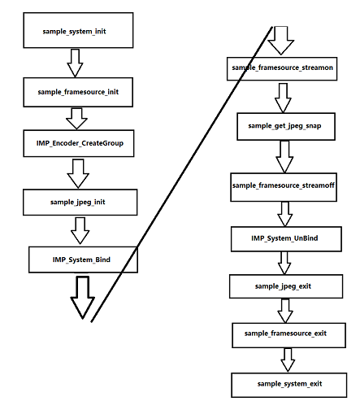
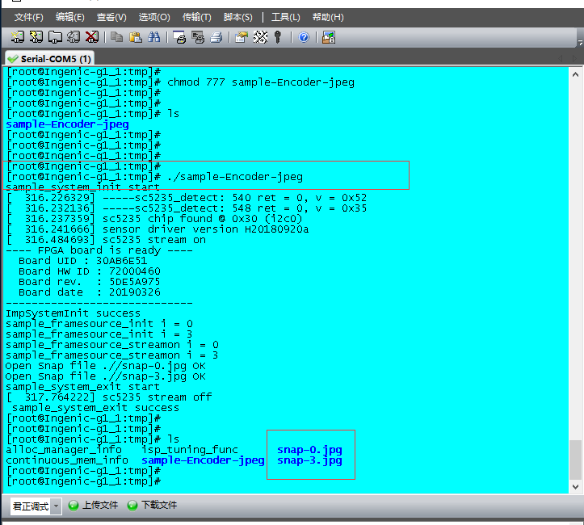

# [Ingenic T31 Application Development][toc]

Getting JPEG stream
-------------------

### Framework for getting JPEG stream

File name `sample-Encoder-jpeg.c`

The main code flow for fetching images is like the following:



First of all, most of the functions in this file depend on the two files `sample-common.h` and `sample-common.c`.
Most of the demos are developed by calling the base library provided by `common.c`.

PS: The base library API functions of Ingenic T31, most of them are `IMP_XXX_XXX` type functions, such as
`IMP_OSD_SetPoolSize`, `IMP_ISP_AddSensor`, etc.

#### Initialize T31 system parameters: sample_system_init

```
int sample_system_init()
{
    int ret = 0;

    IMP_OSD_SetPoolSize(512*1024);
    memset(&sensor_info, 0, sizeof(IMPSensorInfo));
    memcpy(sensor_info.name, SENSOR_NAME, sizeof(SENSOR_NAME));
    sensor_info.cbus_type = SENSOR_CUBS_TYPE;
    memcpy(sensor_info.i2c.type, SENSOR_NAME, sizeof(SENSOR_NAME));
    sensor_info.i2c.addr = SENSOR_I2C_ADDR;

    IMP_LOG_DBG(TAG, "sample_system_init start\n");

    ret = IMP_ISP_Open();
    if(ret < 0){
        IMP_LOG_ERR(TAG, "failed to open ISP\n");
        return -1;
    }

    ret = IMP_ISP_AddSensor(&sensor_info);
    if(ret < 0){
        IMP_LOG_ERR(TAG, "failed to AddSensor\n");
        return -1;
    }

    ret = IMP_ISP_EnableSensor();
    if(ret < 0){
        IMP_LOG_ERR(TAG, "failed to EnableSensor\n");
        return -1;
    }

    ret = IMP_System_Init();
    if(ret < 0){
        IMP_LOG_ERR(TAG, "IMP_System_Init failed\n");
        return -1;
    }

    /* enable turning, to debug graphics */
    ret = IMP_ISP_EnableTuning();
    if(ret < 0){
        IMP_LOG_ERR(TAG, "IMP_ISP_EnableTuning failed\n");
        return -1;
    }
    IMP_ISP_Tuning_SetContrast(128);
    IMP_ISP_Tuning_SetSharpness(128);
    IMP_ISP_Tuning_SetSaturation(128);
    IMP_ISP_Tuning_SetBrightness(128);
#if 1
    ret = IMP_ISP_Tuning_SetISPRunningMode(IMPISP_RUNNING_MODE_DAY);
    if (ret < 0){
        IMP_LOG_ERR(TAG, "failed to set running mode\n");
        return -1;
    }
#endif
#if 0
    ret = IMP_ISP_Tuning_SetSensorFPS(SENSOR_FRAME_RATE_NUM, SENSOR_FRAME_RATE_DEN);
    if (ret < 0){
        IMP_LOG_ERR(TAG, "failed to set sensor fps\n");
        return -1;
    }
#endif
    IMP_LOG_DBG(TAG, "ImpSystemInit success\n");

    return 0;
}
```

which mainly explains this API function: `IMP_ISP_AddSensor`

This function is the system to load the sensor function, our T31 program can not only load a kind of sensor,
but also can load a lot of various sensors, which I bought back from Taobao test machine, it uses the sensor
is SENSOR_SC5235 this kind of sensor.

We can observe the main parameters passed to the SDK through some macro definitions of the sensor in the 
following figure.

The default sensor of the SDK library is jxf23, so if we want to call the JPEG stream for operation, we need
to modify the code before we can use it.


#### Initialize the video source: sample_framesource_init

Key function parameter IMP_FrameSource_CreateChn

According to what we said in the previous section, you have to initialize the video source if you need to
use video related APIs, and the steps to initialize the video source:

Init initialization process:

1. Create the channel
2. Set the channel
3. Enable the channel

The following function mainly does these two steps:

Creating the channel and setting the channel properties.

master stream:
```
struct chn_conf chn[FS_CHN_NUM] = {
{
    .index = CH0_INDEX,
    .enable = CHN0_EN,
    .payloadType = IMP_ENC_PROFILE_HEVC_MAIN,
    .fs_chn_attr = {
        .pixFmt = PIX_FMT_NV12,
        .outFrmRateNum = SENSOR_FRAME_RATE_NUM,
        .outFrmRateDen = SENSOR_FRAME_RATE_DEN,
        .nrVBs = 2,
        .type = FS_PHY_CHANNEL,

        .scaler.enable = 0,

        .crop.enable = CROP_EN,
        .crop.top = 0,
        .crop.left = 0,
        .crop.width = SENSOR_WIDTH,
        .crop.height = SENSOR_HEIGHT,

        .picWidth = SENSOR_WIDTH,
        .picHeight = SENSOR_HEIGHT,
    },
    .framesource_chn =    { DEV_ID_FS, CH0_INDEX, 0},
    .imp_encoder = { DEV_ID_ENC, CH0_INDEX, 0},
},
```

```
int sample_framesource_init()
{
    int i, ret;

    for (i = 0; i < FS_CHN_NUM; i++) {
        if (chn[i].enable) {
            IMP_LOG_INFO(TAG,"sample_framesource_init i = %d\n",i);
            ret = IMP_FrameSource_CreateChn(chn[i].index, &chn[i].fs_chn_attr);
            if(ret < 0){
                IMP_LOG_ERR(TAG, "IMP_FrameSource_CreateChn(chn%d) error !\n", chn[i].index);
                return -1;
            }

            ret = IMP_FrameSource_SetChnAttr(chn[i].index, &chn[i].fs_chn_attr);
            if (ret < 0) {
                IMP_LOG_ERR(TAG, "IMP_FrameSource_SetChnAttr(chn%d) error !\n",  chn[i].index);
                return -1;
            }
        }
    }
    return 0;
}
```

#### Set encoding type IMP_Encoder_CreateGroup

On our side, we set how many groups of data we need to encode, and set the concept of encoding 
groups: also something we talked about in the previous lesson;

An encoding group can encode not only H264 stream data, but also JPEG data.

```
for (i = 0; i < FS_CHN_NUM; i++) {
    if (chn[i].enable) {
        ret = IMP_Encoder_CreateGroup(chn[i].index);
        if (ret < 0) {
            IMP_LOG_ERR(TAG, "IMP_Encoder_CreateGroup(%d) error !\n", i);
            return -1;
        }
    }
}
```

#### Initialize encoding parameters sample_jpeg_init

The most important parameter is this function: `IMP_Encoder_SetDefaultParam`.

Set encoding default parameter: `IMP_ENC_PROFILE_JPEG`.

```
int sample_jpeg_init()
{
    int i, ret;
    IMPEncoderChnAttr channel_attr;
    IMPFSChnAttr *imp_chn_attr_tmp;

    for (i = 0; i <  FS_CHN_NUM; i++) {
        if (chn[i].enable) {
            imp_chn_attr_tmp = &chn[i].fs_chn_attr;
            memset(&channel_attr, 0, sizeof(IMPEncoderChnAttr));
            ret = IMP_Encoder_SetDefaultParam(&channel_attr, IMP_ENC_PROFILE_JPEG, IMP_ENC_RC_MODE_FIXQP,
                    imp_chn_attr_tmp->picWidth, imp_chn_attr_tmp->picHeight,
                    imp_chn_attr_tmp->outFrmRateNum, imp_chn_attr_tmp->outFrmRateDen, 0, 0, 25, 0);
            /* Create Channel */
            ret = IMP_Encoder_CreateChn(4 + chn[i].index, &channel_attr);
            if (ret < 0) {
                IMP_LOG_ERR(TAG, "IMP_Encoder_CreateChn(%d) error: %d\n",
                            chn[i].index, ret);
                return -1;
            }
            /* Resigter Channel */
            ret = IMP_Encoder_RegisterChn(i, 4 + chn[i].index);
            if (ret < 0) {
                IMP_LOG_ERR(TAG, "IMP_Encoder_RegisterChn(0, %d) error: %d\n",
                            chn[i].index, ret);
                return -1;
            }
        }
    }
    return 0;
}
```

#### `IMP_System_Bind` System Binding Function

The main step: is to bind your initialized video source to the encoder in one piece.

```
/* Step.4 Bind */
for (i = 0; i < FS_CHN_NUM; i++) {
    if (chn[i].enable) {
        ret = IMP_System_Bind(&chn[i].framesource_chn, &chn[i].imp_encoder);
        if (ret < 0) {
            IMP_LOG_ERR(TAG, "Bind FrameSource channel%d and Encoder failed\n",i);
            return -1;
        }
    }
}
```

#### Enable video source data `sample_framesource_streamon`

This is the part where you create the video source first, set up the video source again,
and then enable the video source, as mentioned earlier.

```
int sample_framesource_streamon()
{
    int ret = 0, i = 0;
    /* Enable channels */
    for (i = 0; i < FS_CHN_NUM; i++) {
        if (chn[i].enable) {
            IMP_LOG_INFO(TAG,"sample_framesource_streamon i = %d\n",i);
            ret = IMP_FrameSource_EnableChn(chn[i].index);
            if (ret < 0) {
                IMP_LOG_ERR(TAG, "IMP_FrameSource_EnableChn(%d) error: %d\n", ret, chn[i].index);
                return -1;
            }
        }
    }
    return 0;
}
```

### Get JPEG stream function

#### Use `sample_get_jpeg_snap` to get the code stream of the screenshot.

After we've done all the things we initialized earlier, including initializing the video source data
and binding our encoding method, the encoding method we've bound here is the JPEG encoding mode. 
Next we'll get the JPEG data.

`IMP_Encoder_StartRecvPic` opens the encoding Channel to receive the image.

`IMP_Encoder_PollingStream` Polling Stream Cache, we set the timeout to 1 second.

`IMP_Encoder_GetStream`

For H264 and H265 type code streams, one call succeeds in getting one frame of the code stream, 
which may contain multiple packets.

For JPEG type code streams, one call succeeds in getting the code stream of one frame, which 
contains only one package, and this frame contains the complete information of the JPEG image file.

Finally, we call back the data of the structure through this function, and save it to our TF card to
complete the step of acquiring the JPEG stream.

```
/**
 * Define the encoded frame stream type structure
 */
typedef struct {
    uint32_t        phyAddr;      /**< FCS physical ground */
    uint32_t        virAddr;      /**< FCS packet virtualization */
    uint32_t        streamSize;   /**< virAddr corresponds to the size of the allocated address space */
    IMPEncoderPack  *pack;        /**< FCS packet knot */
    uint32_t        packCount;    /**< Number of all packets in a frame of a stream */
    uint32_t        seq;          /**< coded frame stream sequence number */
    union
    {
        IMPEncoderStreamInfo streamInfo;
        IMPEncoderJpegInfo jpegInfo;
    };
} IMPEncoderStream;
```

复制

```
static int save_stream(int fd, IMPEncoderStream *stream)
{
    int ret, i, nr_pack = stream->packCount;

    //IMP_LOG_DBG(TAG, "----------packCount=%d, stream->seq=%u start----------\n", stream->packCount, stream->seq);
    for (i = 0; i < nr_pack; i++) {
        //IMP_LOG_DBG(TAG, "[%d]:%10u,%10lld,%10u,%10u,%10u\n", i, stream->pack[i].length, stream->pack[i].timestamp, stream->pack[i].frameEnd, *((uint32_t *)(&stream->pack[i].nalType)), stream->pack[i].sliceType);
        IMPEncoderPack *pack = &stream->pack[i];
        if(pack->length){
            uint32_t remSize = stream->streamSize - pack->offset;
            if(remSize < pack->length){
                ret = write(fd, (void *)(stream->virAddr + pack->offset), remSize);
                if (ret != remSize) {
                    IMP_LOG_ERR(TAG, "stream write ret(%d) != pack[%d].remSize(%d) error:%s\n", ret, i, remSize, strerror(errno));
                    return -1;
                }
                ret = write(fd, (void *)stream->virAddr, pack->length - remSize);
                if (ret != (pack->length - remSize)) {
                    IMP_LOG_ERR(TAG, "stream write ret(%d) != pack[%d].(length-remSize)(%d) error:%s\n", ret, i, (pack->length - remSize), strerror(errno));
                    return -1;
                }
            }else {
                ret = write(fd, (void *)(stream->virAddr + pack->offset), pack->length);
                if (ret != pack->length) {
                    IMP_LOG_ERR(TAG, "stream write ret(%d) != pack[%d].length(%d) error:%s\n", ret, i, pack->length, strerror(errno));
                    return -1;
                }
            }
        }
    }
    //IMP_LOG_DBG(TAG, "----------packCount=%d, stream->seq=%u end----------\n", stream->packCount, stream->seq);
    return 0;
}
```


#### Release the stream data for our JPEG channel.

`IMP_Encoder_ReleaseStream` - The user must release the fetched stream cache in a timely manner
after fetching the stream, otherwise the stream buffer may be full, affecting the encoder encoding.

This interface should be paired with `IMP_Encoder_GetStream`.

`IMP_Encoder_StopRecvPic` stops the encoding channel from receiving images.


#### Flow of Exit Codes

`sample_framesource_streamoff`

```
int sample_framesource_streamoff()
{
    int ret = 0, i = 0;
    /* Enable channels */
    for (i = 0; i < FS_CHN_NUM; i++) {
        if (chn[i].enable){
            ret = IMP_FrameSource_DisableChn(chn[i].index);
            if (ret < 0) {
                IMP_LOG_ERR(TAG, "IMP_FrameSource_DisableChn(%d) error: %d\n", ret, chn[i].index);
                return -1;
            }
        }
    }
    return 0;
}
```

`IMP_System_UnBind` - Unbinding, we just bind the thread to get the image, from this side, we just get 
a frame of data in the case of the main stream or sub-stream, so the demo has to experiment with the case
is also to get two images, one is the main stream image, one is the sub-stream image.

```
int sample_jpeg_exit(void)
{
    int ret = 0, i = 0, chnNum = 0;
    IMPEncoderChnStat chn_stat;

    for (i = 0; i <  FS_CHN_NUM; i++) {
        if (chn[i].enable) {
            chnNum = 4 + chn[i].index;
            memset(&chn_stat, 0, sizeof(IMPEncoderChnStat));
            ret = IMP_Encoder_Query(chnNum, &chn_stat);
            if (ret < 0) {
                IMP_LOG_ERR(TAG, "IMP_Encoder_Query(%d) error: %d\n", chnNum, ret);
                return -1;
            }

            if (chn_stat.registered) {
                ret = IMP_Encoder_UnRegisterChn(chnNum);
                if (ret < 0) {
                    IMP_LOG_ERR(TAG, "IMP_Encoder_UnRegisterChn(%d) error: %d\n", chnNum, ret);
                    return -1;
                }

                ret = IMP_Encoder_DestroyChn(chnNum);
                if (ret < 0) {
                    IMP_LOG_ERR(TAG, "IMP_Encoder_DestroyChn(%d) error: %d\n", chnNum, ret);
                    return -1;
                }
            }
        }
    }

    return 0;
}
```

#### Exit system initialization to allow the system to shut down functions

`sample_system_exit`

```
int sample_system_exit()
{
    int ret = 0;

    IMP_LOG_DBG(TAG, "sample_system_exit start\n");


    IMP_System_Exit();

    ret = IMP_ISP_DisableSensor();
    if(ret < 0){
        IMP_LOG_ERR(TAG, "failed to EnableSensor\n");
        return -1;
    }

    ret = IMP_ISP_DelSensor(&sensor_info);
    if(ret < 0){
        IMP_LOG_ERR(TAG, "failed to AddSensor\n");
        return -1;
    }

    ret = IMP_ISP_DisableTuning();
    if(ret < 0){
        IMP_LOG_ERR(TAG, "IMP_ISP_DisableTuning failed\n");
        return -1;
    }

    if(IMP_ISP_Close()){
        IMP_LOG_ERR(TAG, "failed to open ISP\n");
        return -1;
    }

    IMP_LOG_DBG(TAG, " sample_system_exit success\n");

    return 0;
}
```

### Experimental effect: get two images

In this, I intentionally added a part of the log inside the demo to make it easier to compare 
with what I described above, and the actual program run follows the process I described.



The resolution obtained is also the same as the one we set up as well, so you can tell that the whole process ended perfectly.


[toc]: index.md
